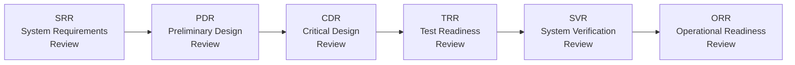
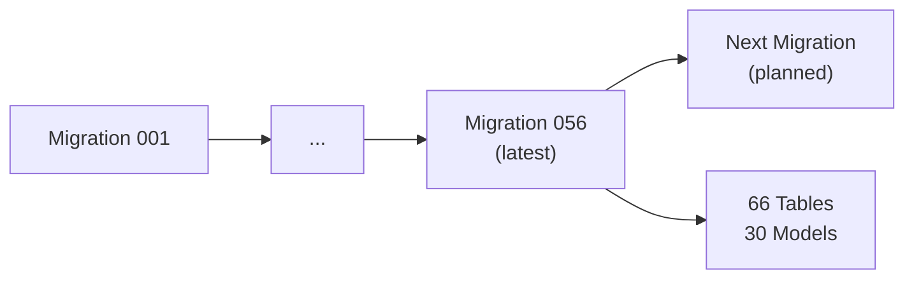
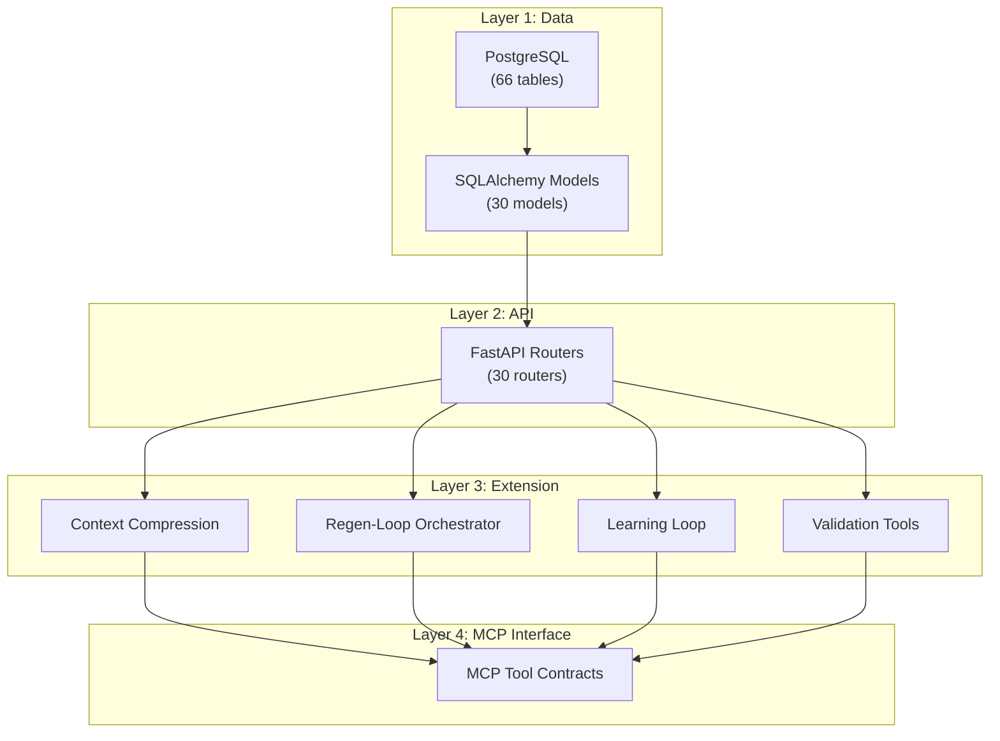

# Systems Engineering Management Plan

| Field | Value |
|---|---|
| Version | 1.0-draft |
| Date | 2026-07-08 |
| Project | OpenCode Architecture Extension |
| System | Knowledge OS (logs-db) |
| Author | TBD |

## Revision History

| Version | Date | Description |
|---|---|---|
| 1.0-draft | 2026-07-08 | Initial draft from automated analysis |

## Project Profile: OpenCode Architecture Extension
Status: active | Type: new-build | Category: Developer Tooling / AI-Assisted Engineering

OpenCode MCP extension providing architecture context compression, validation tools, regen-loop orchestrator with blind mode, and learning loop for LLM-driven code regeneration.

### Live System Metrics (auto-generated at artifact build time)

| Metric | Value |
|---|---|
| Total logs | 0 |
| Database tables | 66 |
| Latest migration | 056 |
| Python source files | 448 |
| Test files | 148 |
| API routers | 30 |
| SQLAlchemy models | 30 |
| HTML templates | 18 |

---

## 1. SE Approach

### 1.1 Methodology Selection

This project applies a **model-based, iterative systems engineering** approach tailored for a solo-developer, AI-assisted development context. The methodology blends ISO/IEC 15288 lifecycle processes with agile delivery cadence, optimized for:

- **Continuous integration of LLM-generated artifacts** — the system both produces and consumes SE outputs
- **Documentation-as-code** — all SE artifacts are version-controlled markdown, generated and validated programmatically
- **Feedback-driven convergence** — learning loops feed operational data back into requirements and architecture decisions

### 1.2 SE Process Tailoring

| ISO/IEC 15288 Process | Tailoring Decision | Rationale |
|---|---|---|
| Stakeholder Needs Definition | Lightweight — solo developer + LLM copilot | Small stakeholder set with rapid feedback |
| Requirements Analysis | Formal with traceability matrix | Critical for regen-loop validation |
| Architecture Definition | C4 model with functional/logical decomposition | Supports context compression use case |
| Verification & Validation | Automated test suite (148 test files) | Solo developer requires automation over manual review |
| Configuration Management | Alembic migrations + Git | 56 migrations demonstrate active schema evolution |
| Integration | Component-level via FastAPI routers (30 endpoints) | API-first architecture enables incremental integration |

### 1.3 SE Governance Model

The SE approach is governed by a **review gate** structure (Section 3) with artifact-based evidence at each gate. The solo-developer context means reviews are self-assessed against checklists, with LLM copilot providing secondary validation through the regen-loop's blind mode.

---

## 2. Work Breakdown Structure

### 2.1 WBS Diagram

```mermaid
graph TD
    A["1.0 Knowledge OS"] --> B["1.1 Core Platform"]
    A --> C["1.2 OpenCode Extension"]
    A --> D["1.3 Integration & Test"]
    A --> E["1.4 SE Management"]

    B --> B1["1.1.1 Database Layer<br/>(66 tables, 56 migrations)"]
    B --> B2["1.1.2 API Layer<br/>(30 routers)"]
    B --> B3["1.1.3 Data Models<br/>(30 SQLAlchemy models)"]
    B --> B4["1.1.4 UI Layer<br/>(18 HTML templates)"]

    C --> C1["1.2.1 Context Compression"]
    C --> C2["1.2.2 Validation Tools"]
    C --> C3["1.2.3 Regen-Loop Orchestrator"]
    C --> C4["1.2.4 Learning Loop"]
    C --> C5["1.2.5 MCP Tool Contracts"]

    D --> D1["1.3.1 Unit Tests"]
    D --> D2["1.3.2 Integration Tests"]
    D --> D3["1.3.3 E2E Benchmarks"]
    D --> D4["1.3.4 Blind Mode Validation"]

    E --> E1["1.4.1 Requirements Traceability"]
    E --> E2["1.4.2 Configuration Control"]
    E --> E3["1.4.3 Review Gates"]
    E --> E4["1.4.4 Risk Monitoring"]
```

### 2.2 Work Package Summary

| WP ID | Work Package | Deliverables | Status |
|---|---|---|---|
| 1.1.1 | Database Layer | Schema, migrations 001–056, seed data | Active |
| 1.1.2 | API Layer | 30 FastAPI routers, endpoint contracts | Active |
| 1.1.3 | Data Models | 30 SQLAlchemy models, Pydantic schemas | Active |
| 1.1.4 | UI Layer | 18 HTML templates, dashboard views | Active |
| 1.2.1 | Context Compression | Architecture context compression engine | Active |
| 1.2.2 | Validation Tools | Schema validation, gap analysis | Active |
| 1.2.3 | Regen-Loop Orchestrator | Orchestration engine with blind mode | Active |
| 1.2.4 | Learning Loop | Feedback capture, lesson curation | Active |
| 1.2.5 | MCP Tool Contracts | MCP interface definitions, sync tooling | Active |
| 1.3.1–1.3.4 | Integration & Test | 148 test files, coverage reports, benchmark results | Active |
| 1.4.1–1.4.4 | SE Management | SEMP, traceability matrix, risk register | Active |

---

## 3. Technical Reviews

### 3.1 Review Gate Structure

### 3.2 Review Gate Definitions

| Gate | Entry Criteria | Evidence Required | Decision Authority |
|---|---|---|---|
| SRR | Stakeholder needs documented, ConOps approved | Requirements Analysis, traceability matrix, MoSCoW prioritization | Developer (self-review) + LLM validation |
| PDR | Functional architecture baselined | Functional Architecture doc, interface definitions, C4 diagrams | Developer |
| CDR | Logical architecture complete, all ADRs recorded | Logical Architecture, technology allocation matrix, ADR index | Developer |
| TRR | Test strategy defined, fixtures in place | Test plan, conftest.py coverage, CI pipeline green | Automated (CI gate) |
| SVR | All verification evidence collected | V&V report, requirements traceability complete, coverage ≥ [TBD]% | Developer + automated metrics |
| ORR | Deployment guide validated, runbooks complete | Operations Manual, Maintenance Manual, health checks passing | Developer |

### 3.3 Continuous Review Mechanisms

Beyond formal gates, the following continuous review processes operate:

- **Regen-Loop Blind Mode Validation** — automated architectural consistency checks on every regeneration cycle
- **E2E Benchmark Regression Review** — performance regression detection on integration
- **Gap Analyzer Threshold Calibration** — periodic review of context compression fidelity thresholds
- **MCP Tool Contract Synchronization** — interface compatibility verification on schema changes

---

## 4. Risk Management

### 4.1 Risk Register

| ID | Risk | Likelihood | Impact | Mitigation Strategy |
|---|---|---|---|---|
| R-01 | Schema drift between 66 tables and 30 SQLAlchemy models causes runtime errors | Medium | High | Automated schema validation in CI; Alembic migration discipline with up-to-date model reflection |
| R-02 | Context compression loses critical architectural semantics during LLM handoff | Medium | High | Learning loop feedback; blind mode validation gates; compression tuning calibration cycles |
| R-03 | Solo-developer resource bottleneck delays integration across 448 source files | High | Medium | Prioritized WBS delivery; LLM-assisted code generation; automation of repetitive tasks |
| R-04 | Regen-loop produces code that passes tests but violates architectural intent | Medium | High | Blind mode validation; ADR cross-reference in prompts; prompt template versioning |
| R-05 | Migration complexity (56 migrations) creates irreversible database states | Low | High | Migration testing in isolated environments; rollback scripts; backup before migration |
| R-06 | MCP tool contract breaking changes disrupt extension consumers | Medium | Medium | Contract synchronization process; semantic versioning; ICD maintenance |
| R-07 | Test coverage gaps in 148 test files leave critical paths unverified | Medium | Medium | Coverage tracking; gap analysis tooling; test-driven development discipline |
| R-08 | LLM dependency introduces non-deterministic behavior in learning loop | High | Low | Deterministic fallback paths; output validation; lesson curation review |

### 4.2 Risk Monitoring

Risks are monitored continuously through:
- Pipeline event data analysis
- Schema change history tracking
- LLM service dependency status checks
- Migration success/failure logging

See *Risk Management* process artifact for full risk response plans and monitoring cadence.

---

## 5. Configuration Management

### 5.1 Version Control Strategy

| Asset Type | Control Mechanism | Branching Strategy |
|---|---|---|
| Source code (448 files) | Git | [TBD — trunk-based or feature-branch] |
| Database schema | Alembic migrations (001–056) | Sequential, linear migration chain |
| SE artifacts | Git-versioned markdown | Co-located with source |
| Test fixtures | Git | Managed alongside test files |
| Prompt templates | Versioned files with changelog | Prompt Template Versioning process |

### 5.2 Migration Strategy

The system employs **Alembic** for schema configuration management with 56 sequential migrations governing 66 database tables:

**Migration Discipline:**
- Each migration is atomic and reversible where possible
- Migration testing occurs in isolated database instances before production apply
- Model-migration synchronization is verified as part of TRR gate criteria

### 5.3 Environment Management

| Environment | Purpose | Configuration Source |
|---|---|---|
| Development | Local development, rapid iteration | `.env` file, local PostgreSQL |
| Test | Automated test execution (148 test files) | CI-managed, ephemeral database |
| Production | Operational system | [TBD] — See Deployment Guide |

### 5.4 Baseline Management

| Baseline | Content | Establishment Point |
|---|---|---|
| Requirements Baseline | Approved requirements with traceability | Post-SRR |
| Architecture Baseline | Functional + Logical architecture | Post-CDR |
| Schema Baseline | Migration state + model definitions | Each migration apply |
| Test Baseline | Test suite passing state | Post-TRR |

---

## 6. Integration Strategy

### 6.1 Integration Approach

The system employs **incremental, API-first integration** leveraging the 30 FastAPI routers as integration boundaries:

### 6.2 Integration Sequence

| Phase | Components Integrated | Verification Method |
|---|---|---|
| Phase 1 | Database layer + SQLAlchemy models | Unit tests, migration validation |
| Phase 2 | Models + API routers | Integration tests, endpoint contract verification |
| Phase 3 | API + Extension components (context compression, regen-loop, learning loop) | System tests, blind mode validation |
| Phase 4 | Extension + MCP interface | Contract synchronization, E2E benchmarks |

### 6.3 Integration Verification

Each integration phase produces evidence through:

- **Automated test execution** — 148 test files providing unit and integration coverage
- **Blind mode validation** — regen-loop outputs verified without human-in-the-loop bias
- **Contract synchronization checks** — MCP tool interfaces validated against ICD specifications
- **E2E benchmark regression** — performance baselines maintained across integration events

### 6.4 Cross-References

- See *ICD* for detailed interface specifications between integration layers
- See *Testing* artifact for test architecture and category definitions
- See *Verification & Validation* for requirements traceability to integration evidence
- See *project-management-plan* for PM integration with SE review gates

---

## Appendix A: Process-to-SEMP Mapping

| SEMP Section | Supporting Processes |
|---|---|
| SE Approach | Requirements Analysis, Functional Architecture, Logical Architecture |
| WBS | Scope Management, Schedule Management |
| Technical Reviews | Verification & Validation, Quality Management |
| Risk Management | Risk Management (dedicated process) |
| Configuration Management | ADRs, Deployment Guide, Alembic migrations |
| Integration Strategy | Integration Management, Testing, ICD, Signal Path Atlas |