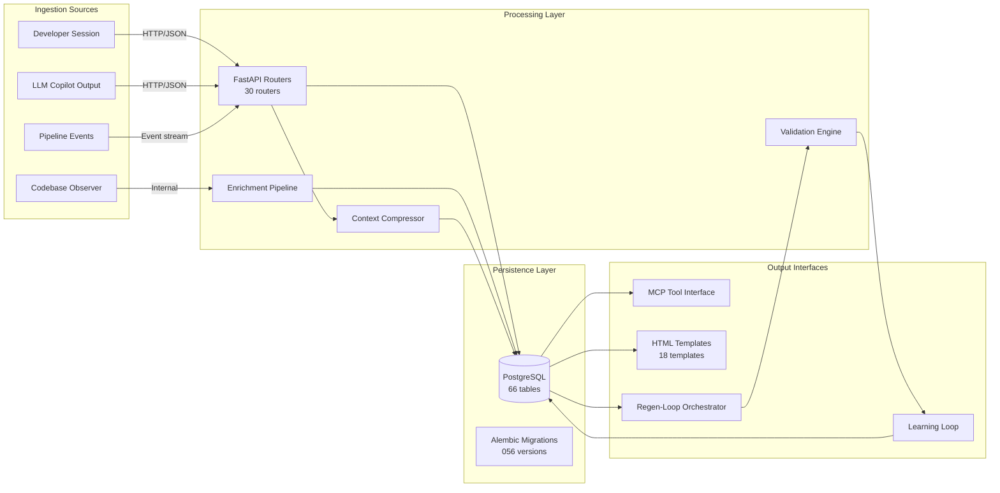
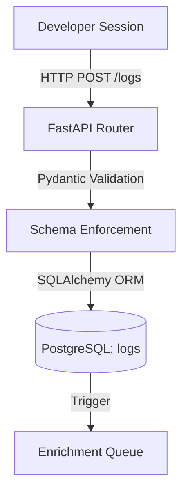
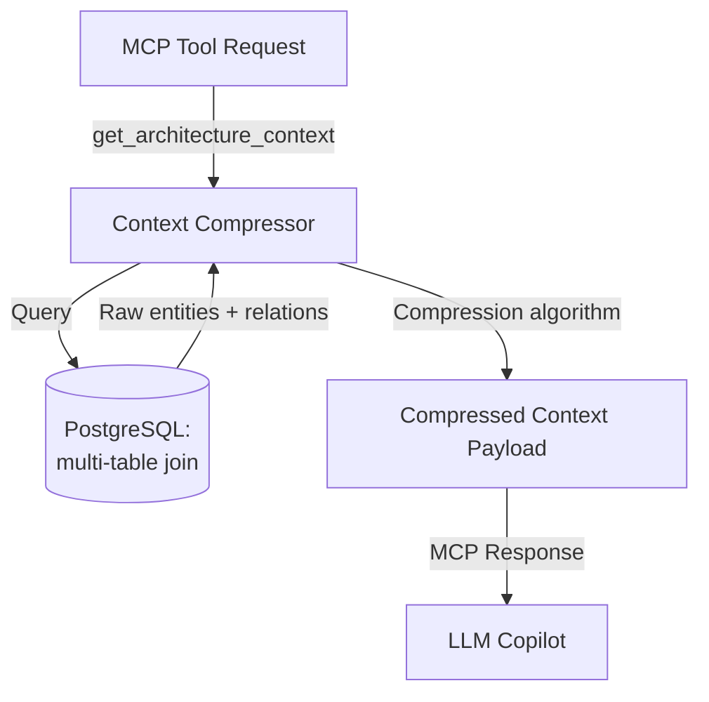
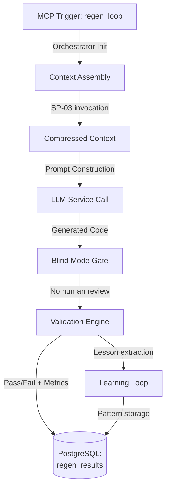
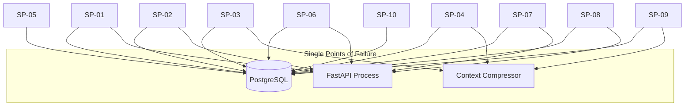

# Signal Path Atlas

| Field | Value |
|---|---|
| Version | 1.0-draft |
| Date | 2026-07-08 |
| Project | OpenCode Architecture Extension |
| System | Knowledge OS (logs-db) |
| Author | TBD |

## Revision History

| Version | Date | Description |
|---|---|---|
| 1.0-draft | 2026-07-08 | Initial draft from automated analysis |

## Project Profile: OpenCode Architecture Extension
Status: active | Type: new-build | Category: Developer Tooling / Knowledge Management

OpenCode MCP extension providing architecture context compression, validation tools, regen-loop orchestrator with blind mode, and learning loop for LLM-driven code regeneration.

### Live System Metrics (auto-generated at artifact build time)

| Metric | Value |
|---|---|
| Total logs | 0 |
| Database tables | 66 |
| Latest migration | 056 |
| Python source files | 448 |
| Test files | 148 |
| API routers | 30 |
| SQLAlchemy models | 30 |
| HTML templates | 18 |

---

## 1. Data Flow Overview

The Knowledge OS operates as a multi-path data system where information flows from external ingestion sources (developer sessions, LLM interactions, codebase observations) through processing pipelines into PostgreSQL storage, then out through API endpoints and MCP tool interfaces for consumption by LLM copilots and human operators.

## 2. Path Inventory

| Path ID | Path Name | Source | Sink | Hops | Protocols | Criticality |
|---|---|---|---|---|---|---|
| SP-01 | Log Ingestion | Developer Session | PostgreSQL (logs table) | 3 | HTTP → JSON → SQL | High |
| SP-02 | Entity CRUD | API Client | PostgreSQL (entity tables) | 2 | HTTP/JSON → SQL | High |
| SP-03 | Context Compression | PostgreSQL (raw data) | MCP Tool Interface | 3 | SQL → Internal → MCP/JSON | Critical |
| SP-04 | Regen Loop Orchestration | MCP Trigger | PostgreSQL (regen results) | 5 | MCP → Internal → LLM API → Validation → SQL | Critical |
| SP-05 | Learning Loop Feedback | Validation Engine | PostgreSQL (lessons) | 3 | Internal → Analysis → SQL | High |
| SP-06 | Pipeline Event Capture | Pipeline Runtime | PostgreSQL (pipeline_events) | 2 | Event/JSON → SQL | Medium |
| SP-07 | Template Rendering | PostgreSQL | HTML Response | 3 | SQL → Jinja2 → HTTP/HTML | Medium |
| SP-08 | LLM Feedback Recording | LLM Service Response | PostgreSQL (llm_feedback) | 3 | HTTP → JSON Parse → SQL | High |
| SP-09 | Architecture Artifact Query | MCP Client | Compressed Context | 4 | MCP → SQL → Compression → MCP/JSON | Critical |
| SP-10 | Blind Mode Validation | Regen Orchestrator | Validation Results | 3 | Internal → Diff Analysis → SQL | High |

## 3. Detailed Path Descriptions

### SP-01: Log Ingestion Path

**Purpose:** Primary knowledge capture path. Developer observations, decisions, and context enter the system here.

**Data transformation:** Raw text/JSON → Pydantic model validation → SQLAlchemy model → PostgreSQL row with auto-generated metadata (timestamps, IDs).

### SP-03: Context Compression Path (Critical)

**Purpose:** Core value path — transforms 66 tables of raw knowledge into compressed, LLM-consumable context. Directly impacts code regeneration quality.

**Data transformation:** Multi-table SQL query results → entity graph assembly → architecture compression → structured JSON context envelope.

### SP-04: Regen Loop Orchestration Path (Critical)

**Purpose:** Full automation path for code regeneration. Blind mode bypasses human review, relying entirely on automated validation.

**Hops:** MCP Interface → Context Compressor → LLM External API → Validation Engine → Learning Loop → PostgreSQL

## 4. Protocol Transitions

| Path ID | Hop | From Protocol | To Protocol | Transition Point | Transform |
|---|---|---|---|---|---|
| SP-01 | 1→2 | HTTP/JSON | Python objects | FastAPI Router (Pydantic) | Deserialization + validation |
| SP-01 | 2→3 | Python objects | SQL | SQLAlchemy ORM | ORM mapping |
| SP-03 | 1→2 | MCP JSON-RPC | SQL | Context Compressor | Query construction |
| SP-03 | 2→3 | SQL result sets | MCP JSON-RPC | Compression engine | Graph compression |
| SP-04 | 2→3 | Internal Python | HTTP/JSON | LLM API client | External API call |
| SP-04 | 3→4 | HTTP/JSON (LLM response) | Internal Python | Response parser | Code extraction |
| SP-04 | 4→5 | Internal Python | SQL | Validation → ORM | Result persistence |
| SP-07 | 1→2 | SQL result sets | Jinja2 template vars | Template engine | Dict mapping |
| SP-07 | 2→3 | Jinja2 rendered | HTTP/HTML | FastAPI response | Content-Type assignment |
| SP-09 | 1→2 | MCP JSON-RPC | SQL | Artifact query builder | Schema-aware query gen |

## 5. Latency Budget

| Path ID | Path Name | Total Budget | Hop 1 | Hop 2 | Hop 3 | Hop 4 | Hop 5 |
|---|---|---|---|---|---|---|---|
| SP-01 | Log Ingestion | < 200ms | 50ms (HTTP parse) | 20ms (validation) | 100ms (DB write) | — | — |
| SP-03 | Context Compression | < 2s | 100ms (MCP decode) | 500ms (multi-table query) | 1000ms (compression) | — | — |
| SP-04 | Regen Loop | < 60s | 2s (context) | 30s (LLM API) | 15s (validation) | 5s (learning) | 1s (persist) |
| SP-07 | Template Rendering | < 500ms | 200ms (DB query) | 150ms (Jinja2) | 50ms (response) | — | — |
| SP-09 | Architecture Query | < 3s | 100ms (MCP) | 800ms (SQL) | 1500ms (compression) | 100ms (response) | — |

**Notes:**
- SP-04 is dominated by external LLM API latency (Hop 2) — not controllable internally
- SP-03 and SP-09 compression time scales with entity count; budget assumes current 66-table schema
- All SQL hop budgets assume local PostgreSQL with warm connection pool

## 6. Single Points of Failure

| Component | Paths Affected | Impact | Mitigation |
|---|---|---|---|
| PostgreSQL | All 10 paths (SP-01 through SP-10) | Total system failure — no reads or writes | Automated backups; connection pool resilience; see Maintenance Manual |
| FastAPI Process (uvicorn) | SP-01, SP-02, SP-06, SP-07, SP-08 | All HTTP ingestion and rendering halted | Process supervisor (systemd/docker restart); see Deployment Guide |
| Context Compressor | SP-03, SP-04, SP-09 | All LLM-facing context delivery fails; regen loop inoperable | [TBD — redundancy strategy not yet defined] |
| External LLM API | SP-04 | Regen loop halted; no code generation | Timeout + retry logic; graceful degradation to queued mode |
| MCP Interface | SP-03, SP-04, SP-09, SP-10 | OpenCode extension loses all tool access | [TBD — MCP reconnection strategy] |

## 7. Failure Mode Analysis

### PostgreSQL Failure

| Failure Mode | Detection | Impact | Recovery |
|---|---|---|---|
| Connection refused | Health endpoint returns 503 | All paths blocked | Auto-restart; pool reconnection |
| Disk full | Write failure exception | Ingestion paths fail; reads may continue | Alert + disk cleanup; see Operations Manual |
| Corruption | Integrity check failure | Data loss risk across all entities | Restore from backup; validate migration state |

### Context Compressor Failure

| Failure Mode | Detection | Impact | Recovery |
|---|---|---|---|
| OOM on large context | Process crash / timeout | SP-03, SP-04, SP-09 return errors | Chunked compression; memory limits |
| Stale schema cache | Incorrect context delivered | LLM receives outdated architecture info | Cache invalidation on migration events |
| Compression algorithm error | Validation failure downstream | Regen loop produces invalid code | Fallback to uncompressed context |

### External LLM API Failure

| Failure Mode | Detection | Impact | Recovery |
|---|---|---|---|
| Timeout (>30s) | Request timeout | SP-04 Hop 2 fails | Retry with exponential backoff |
| Rate limit (429) | HTTP status code | Regen loop throttled | Queue requests; respect rate headers |
| Service outage | Repeated failures | All code regeneration halted | Alert operator; queue for retry |

### Regen Loop Blind Mode Failure

| Failure Mode | Detection | Impact | Recovery |
|---|---|---|---|
| Validation false-positive | Learning loop anomaly detection | Invalid code accepted without human review | Periodic human audit; threshold calibration (see Gap Analyzer Threshold Calibration process) |
| Validation false-negative | Repeated regen attempts | Valid code rejected; loop stalls | Adjust validation criteria; alert on retry count |

## 8. Cross-References

| Related Artifact | Relevance to Signal Path Atlas |
|---|---|
| ICD | Protocol details, API contracts, data format specifications for each interface |
| Functional Architecture | Functional block decomposition that maps to processing nodes |
| Logical Architecture | Technology allocation for each hop in the signal paths |
| Data Dictionary | Complete schema details for all 66 tables referenced as sinks |
| Operations Manual | Fluid/electrical paths excluded from this document; operational procedures |
| Deployment Guide | Infrastructure topology affecting path latency and failure modes |
| Testing | Verification coverage per signal path; see 148 test files |

---

## 9. Open Items

| Item | Path(s) Affected | Status |
|---|---|---|
| MCP reconnection/failover strategy | SP-03, SP-04, SP-09, SP-10 | [TBD] |
| Context compressor redundancy | SP-03, SP-04, SP-09 | [TBD] |
| Measured latency baselines (actual vs. budget) | All | [TBD — requires instrumentation] |
| Pipeline event stream protocol specification | SP-06 | [TBD — see ICD] |
| Blind mode false-positive rate threshold | SP-04, SP-10 | [TBD — see Regen Loop Blind Mode Validation process] |