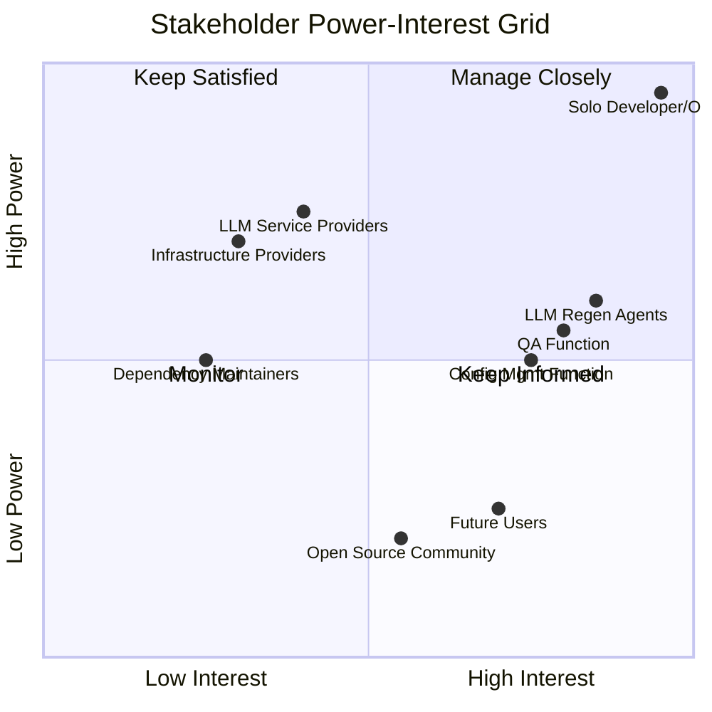

# Stakeholder Register

| Field | Value |
|---|---|
| Version | 1.0-draft |
| Date | 2026-07-08 |
| Project | OpenCode Architecture Extension |
| System | N/A |
| Author | TBD |

## Revision History

| Version | Date | Description |
|---|---|---|
| 1.0-draft | 2026-07-08 | Initial draft from automated analysis |

## Project Profile: OpenCode Architecture Extension
Status: active | Type: new-build | Category: 
OpenCode MCP extension providing architecture context compression, validation tools, regen-loop orchestrator with blind mode, and learning loop for LLM-driven code regeneration.

### Live System Metrics (auto-generated at artifact build time)
| Metric | Value |
|---|---|
| Total logs | 0 |
| Database tables | 66 |
| Latest migration | 056 |
| Python source files | 448 |
| Test files | 148 |
| API routers | 30 |
| SQLAlchemy models | 30 |
| HTML templates | 18 |

---

## 1. Stakeholder Identification

Stakeholders are identified from the project's process documentation, system interfaces, operational context, and the solo-developer resource model described in the source material.

### 1.1 Internal Stakeholders

| ID | Stakeholder | Role | Category |
|---|---|---|---|
| S-01 | Solo Developer/Operator | Primary developer, architect, operator, and project manager | Internal – Core |
| S-02 | LLM Code Regeneration Agents | AI agents consuming architecture context, executing regen loops, and producing code | Internal – System Actor |
| S-03 | OpenCode MCP Extension (System) | The extension itself as a stakeholder in integration integrity | Internal – System |

### 1.2 External Stakeholders

| ID | Stakeholder | Role | Category |
|---|---|---|---|
| S-04 | LLM Service Providers | External API providers (e.g., Claude, GPT) supplying inference capabilities | External – Vendor |
| S-05 | Infrastructure Providers | Cloud/compute providers hosting PostgreSQL, application services | External – Vendor |
| S-06 | Future Users/Contributors | Potential adopters of the Knowledge OS or OpenCode extension | External – Consumer |
| S-07 | Open Source Community | Consumers of public documentation, README, and published artifacts | External – Community |
| S-08 | Dependency Maintainers | Maintainers of libraries (FastAPI, SQLAlchemy, Alembic, pytest, etc.) | External – Supplier |

### 1.3 Governance Stakeholders

| ID | Stakeholder | Role | Category |
|---|---|---|---|
| S-09 | Quality Assurance Function | Represented by the 148 test files and CI pipeline; ensures system correctness | Internal – Governance |
| S-10 | Configuration Management Function | Migration history (056 migrations), ADR process, and version control | Internal – Governance |

---

## 2. Stakeholder Analysis

### 2.1 Power/Interest Grid

### 2.2 Analysis Summary

| Quadrant | Stakeholders | Strategy |
|---|---|---|
| **Manage Closely** (High Power, High Interest) | Solo Developer/Operator, LLM Regen Agents, QA Function | Active engagement, direct feedback loops, priority alignment |
| **Keep Satisfied** (High Power, Low Interest) | LLM Service Providers, Infrastructure Providers | Ensure SLA compliance, monitor cost, maintain contracts |
| **Keep Informed** (Low Power, High Interest) | Future Users, Config Mgmt Function | Documentation quality, transparency, accessibility |
| **Monitor** (Low Power, Low Interest) | Open Source Community, Dependency Maintainers | Periodic review, license compliance checks |

---

## 3. Stakeholder Register

| ID | Name/Role | Interest | Influence | Current Engagement | Desired Engagement | Strategy |
|---|---|---|---|---|---|---|
| S-01 | Solo Developer/Operator | System functionality, architecture coherence, velocity, learning loop effectiveness | **High** – Makes all decisions | Leading | Leading | Self-directed sprints; pipeline automation reduces cognitive load |
| S-02 | LLM Code Regeneration Agents | Context compression quality, prompt accuracy, validation feedback, blind mode correctness | **High** – Output quality drives system value | Supportive | Leading | Improve context compression tuning; calibrate gap analyzer thresholds; version prompt templates |
| S-03 | OpenCode MCP Extension | Integration stability, tool contract synchronization, API surface consistency | **Medium** – Constrains architectural choices | Neutral | Supportive | MCP tool contract sync process; E2E benchmark regression review |
| S-04 | LLM Service Providers | API consumption volume, contract compliance, rate limits | **High** – Service availability gates regen loops | Neutral | Supportive | Monitor API usage metrics; maintain fallback strategies; track via Cost Management |
| S-05 | Infrastructure Providers | Uptime, cost efficiency, resource utilization | **High** – Platform availability | Neutral | Neutral | Budget baseline tracking; earned value monitoring; see Cost Management artifact |
| S-06 | Future Users/Contributors | Usability, documentation clarity, onboarding experience | **Low** – No current decision authority | Unaware | Informed | README maintenance; Operations Manual; Deployment Guide accessibility |
| S-07 | Open Source Community | Transparency, license compliance, reusability | **Low** – Indirect influence through adoption | Unaware | Informed | Technology Radar publication; license audits via Procurement Management |
| S-08 | Dependency Maintainers | Compatibility, security patches, breaking changes | **Medium** – Upstream changes force adaptation | Unaware | Monitored | Procurement Management make-or-buy reviews; dependency update procedures in Maintenance Manual |
| S-09 | QA Function | Test coverage, data integrity, regression prevention | **Medium** – Gates releases | Supportive | Leading | 148 test files maintained; V&V traceability; Quality Management continuous improvement |
| S-10 | Config Mgmt Function | Migration integrity, ADR consistency, baseline control | **Medium** – Constrains change process | Supportive | Supportive | 056 migrations tracked; ADR process; Integration Management change control |

---

## 4. Engagement Strategies

### S-01: Solo Developer/Operator

**Engagement Approach:** Self-managed with automation support. All project management knowledge areas (scope, schedule, cost, quality, risk, resources) converge on this single stakeholder. The engagement strategy focuses on reducing cognitive overhead through:

- Pipeline-driven status visibility (see Communications Management process)
- Automated metrics collection (live system metrics above)
- Sprint-based schedule management with clear milestone gates
- Learning loop feedback integration for continuous improvement

**Communication Preferences:** Cross-reference Communications Management artifact for detailed procedures. Primary channels: IDE-integrated tooling, project logs, pipeline events.

---

### S-02: LLM Code Regeneration Agents

**Engagement Approach:** Agents are engaged through structured interfaces rather than traditional communication. Quality of engagement is measured by regen-loop success rates and context compression effectiveness.

| Engagement Mechanism | Purpose | Frequency |
|---|---|---|
| Context Compression Tuning | Optimize architecture context delivery | Per regen cycle |
| Prompt Template Versioning | Ensure consistent, effective prompts | On template change |
| Gap Analyzer Threshold Calibration | Tune validation sensitivity | Periodic review |
| Regen Loop Blind Mode Validation | Verify output quality without oracle | Per blind-mode execution |
| Learning Loop Lesson Curation | Feed validated lessons back into agent context | Continuous |

---

### S-03: OpenCode MCP Extension (System)

**Engagement Approach:** Treated as an integration stakeholder. Engagement occurs through:

- MCP Tool Contract Synchronization (ensuring tool definitions match implementation)
- E2E Benchmark Regression Review (detecting degradation across 30 API routers)
- ICD maintenance for interface stability across 66 database tables

**Escalation Trigger:** Breaking changes to MCP tool contracts or API surface require immediate ADR documentation.

---

### S-04: LLM Service Providers

**Engagement Approach:** Vendor relationship managed through:

- API usage monitoring and cost tracking (Cost Management process)
- Rate limit awareness in regen-loop orchestration
- Fallback/retry strategies documented in Operations Manual
- Risk register entries for service dependency (Risk Management process)

**Communication Preferences:** Cross-reference Communications Management. Engagement is contract-driven; no proactive outreach unless triggered by service degradation or cost variance.

---

### S-05: Infrastructure Providers

**Engagement Approach:** Minimal active engagement. Managed through:

- Budget baseline adherence (Cost Management)
- Health check procedures (Maintenance Manual)
- Deployment Guide for environment configuration

**Escalation Trigger:** Cost variance exceeding [TBD]% or unplanned downtime.

---

### S-06: Future Users/Contributors

**Engagement Approach:** Passive engagement through documentation quality:

- README artifact maintained as primary orientation document
- Deployment Guide for onboarding
- Concept of Operations for operational understanding
- Use Cases artifact for scenario comprehension

**Desired Transition:** Move from Unaware → Informed as system matures toward public release milestones (see Product Roadmap).

---

### S-07: Open Source Community

**Engagement Approach:** Transparency-focused:

- Technology Radar for technology adoption visibility
- License compliance via Procurement Management audits
- Public documentation artifacts

**Communication Preferences:** Asynchronous; documentation-as-communication.

---

### S-08: Dependency Maintainers

**Engagement Approach:** Passive monitoring with reactive engagement:

- Automated dependency vulnerability scanning
- Procurement Management make-or-buy re-evaluation on major version changes
- Maintenance Manual corrective procedures for breaking updates

**Escalation Trigger:** Security advisory or breaking change affecting 448 Python source files.

---

### S-09: QA Function (Automated)

**Engagement Approach:** Continuous integration engagement:

- 148 test files executing against 30 API routers and 30 SQLAlchemy models
- Quality Management process drives coverage targets
- V&V process traces requirements to test evidence
- Testing artifact defines category boundaries and mocking patterns

**Key Metric:** Test pass rate and coverage trends tracked per sprint cycle.

---

### S-10: Configuration Management Function

**Engagement Approach:** Process-driven engagement:

- 056 Alembic migrations maintained with strict sequencing
- ADR process captures architectural decisions
- Integration Management change control for baseline updates
- Systems Engineering Management Plan governs review gates

**Key Metric:** Migration integrity (no gaps in sequence), ADR currency.

---

## Cross-References

| Related Artifact | Relationship |
|---|---|
| Communications Management | Defines detailed communication procedures, channels, and frequencies |
| Risk Management | Contains risk register entries for stakeholder-related risks (e.g., vendor dependency) |
| Cost Management | Tracks vendor cost implications for S-04, S-05 |
| Requirements Analysis | Traces stakeholder needs to requirements |
| Product Roadmap | Defines milestones that trigger engagement level transitions |
| Concept of Operations | Provides operational context informing stakeholder identification |

---

*End of document. Next review: [TBD] or upon stakeholder landscape change.*