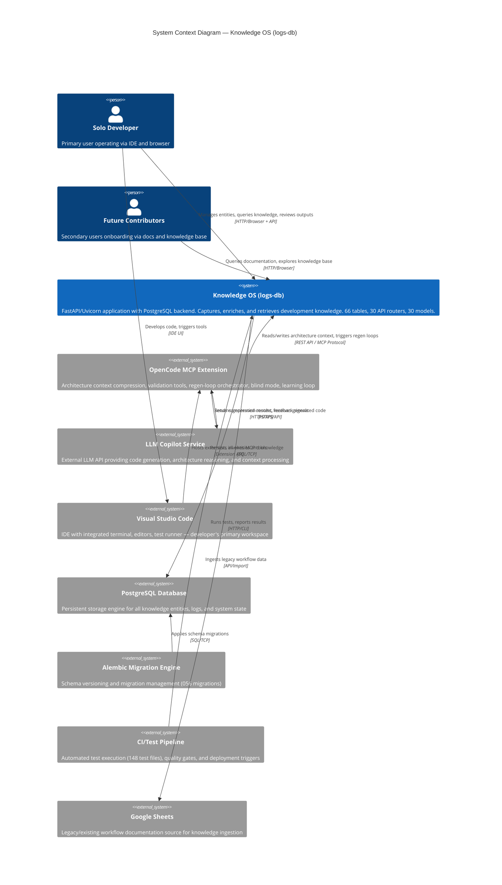
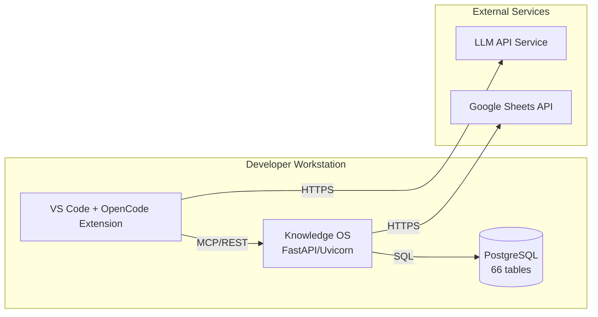

# System Context Diagram

| Field | Value |
|---|---|
| Version | 1.0-draft |
| Date | 2026-07-08 |
| Project | OpenCode Architecture Extension |
| System | Knowledge OS (logs-db) |
| Author | [TBD] |

## Revision History

| Version | Date | Description |
|---|---|---|
| 1.0-draft | 2026-07-08 | Initial draft from automated analysis |

## Project Profile: OpenCode Architecture Extension
Status: active | Type: new-build | Category: Developer Tooling / Knowledge Management

OpenCode MCP extension providing architecture context compression, validation tools, regen-loop orchestrator with blind mode, and learning loop for LLM-driven code regeneration.

### Live System Metrics (auto-generated at artifact build time)

| Metric | Value |
|---|---|
| Total logs | 0 |
| Database tables | 66 |
| Latest migration | 056 |
| Python source files | 448 |
| Test files | 148 |
| API routers | 30 |
| SQLAlchemy models | 30 |
| HTML templates | 18 |

---

## 1. System-of-Systems View

The Knowledge OS (logs-db) operates as the persistence and knowledge management backbone for the OpenCode Architecture Extension ecosystem. It interfaces with human operators, LLM services, IDE tooling, and infrastructure services to enable AI-assisted code regeneration with architectural awareness.

## 2. External Actor Inventory

| Actor | Type | Description | Interaction Mode |
|---|---|---|---|
| Solo Developer | Human (Primary) | Operates the system day-to-day; captures knowledge, triggers regeneration, reviews outputs | Browser UI, API calls, IDE commands |
| Future Contributors | Human (Secondary) | Onboards via searchable knowledge base and generated documentation | Browser UI (read-heavy) |
| LLM Copilot Service | External System | Automated agent receiving structured context for code generation and architecture reasoning | HTTPS API (outbound from extension) |
| OpenCode MCP Extension | External System | IDE extension consuming architecture context, orchestrating regen loops, and invoking validation tools | REST API / MCP Protocol |
| Visual Studio Code | External System | IDE hosting the extension, providing workspace context, terminal, and test runner | Extension Host API |
| PostgreSQL Database | Infrastructure | Relational store for all 66 tables of knowledge entities | SQL over TCP (localhost or network) |
| Alembic Migration Engine | Infrastructure Tool | Manages schema evolution through 056 versioned migrations | CLI / programmatic invocation |
| CI/Test Pipeline | External System | Executes 148 test files, enforces quality gates | HTTP triggers, CLI execution |
| Google Sheets | External Data Source | Legacy workflow documentation used as ingestion source | API import (read-only) |

## 3. Interface Summary

| From | To | Protocol | Category | Purpose |
|---|---|---|---|---|
| OpenCode MCP Extension | Knowledge OS | REST API / MCP | Data | Read architecture context, write regen results, trigger learning loop |
| Knowledge OS | PostgreSQL | SQL/TCP | Data | Persist and query all knowledge entities (66 tables) |
| Solo Developer | Knowledge OS | HTTP (Browser) | UI | Entity management, knowledge queries, output review |
| OpenCode MCP Extension | LLM Copilot Service | HTTPS | Integration | Send compressed context, receive generated code |
| LLM Copilot Service | OpenCode MCP Extension | HTTPS | Integration | Return generation results and feedback signals |
| CI/Test Pipeline | Knowledge OS | HTTP/CLI | Automation | Execute test suite, report quality metrics |
| Alembic | PostgreSQL | SQL/TCP | Infrastructure | Apply schema migrations |
| Knowledge OS | Google Sheets | HTTPS/API | Data Ingestion | Import legacy workflow documentation |
| VS Code | OpenCode MCP Extension | Extension API | Integration | Host extension, route MCP tool invocations |

See ICD for detailed interface specifications, payload schemas, and protocol constraints.

## 4. External Dependencies

| Dependency | Type | Criticality | Notes |
|---|---|---|---|
| PostgreSQL | Database | Critical | Primary persistence layer for all 66 tables; system non-functional without it |
| LLM API Service | External API | High | Required for code generation, context reasoning; degraded mode possible without it |
| Python Runtime | Platform | Critical | FastAPI/Uvicorn application requires Python environment |
| Alembic | Library/Tool | High | Schema management; required for deployment and upgrades |
| FastAPI/Uvicorn | Framework | Critical | Application server framework; 30 API routers depend on it |
| SQLAlchemy | ORM | Critical | 30 models mapped to database; data access layer |
| Pytest | Test Framework | Medium | 148 test files executed via CI pipeline |
| OpenCode MCP SDK | Library | High | Extension integration protocol implementation |
| Google Sheets API | External API | Low | Legacy data import; not required for core operation |

## 5. Integration Points

Where other systems connect **into** Knowledge OS:

| Integration Point | Consumer | Method | Authentication | Rate Limiting |
|---|---|---|---|---|
| REST API (30 routers) | OpenCode MCP Extension | HTTP REST | [TBD] | [TBD] |
| REST API (30 routers) | Solo Developer (Browser) | HTTP REST | [TBD] | [TBD] |
| HTML Templates (18) | Solo Developer (Browser) | HTTP GET (rendered views) | [TBD] | N/A |
| CI Test Hooks | CI/Test Pipeline | HTTP/CLI invocation | [TBD] | N/A |
| MCP Tool Endpoints | OpenCode Extension | MCP Protocol | [TBD] | [TBD] |

### Key Integration Patterns

1. **Context Compression Pipeline**: OpenCode Extension requests compressed architecture context → Knowledge OS queries relevant entities across 66 tables → returns structured context payload optimized for LLM token budgets.

2. **Regen-Loop Orchestration**: Extension triggers regeneration → Knowledge OS provides baseline context → LLM generates code → results validated → feedback stored in learning loop tables.

3. **Blind Mode Validation**: Regen loop operates without human review; Knowledge OS stores validation evidence for post-hoc audit via V&V processes.

4. **Learning Loop Feedback**: LLM generation outcomes (success/failure, quality metrics) flow back into Knowledge OS to improve future context compression and prompt selection.

## 6. Environmental Context

| Aspect | Detail |
|---|---|
| Deployment Model | [TBD] — likely local development server (uvicorn) with optional containerized deployment |
| Network Segment | Local development machine; PostgreSQL co-located or on local network |
| Access Requirements | Solo developer access; no multi-tenant authentication currently indicated |
| Infrastructure | Docker-compose indicated in maintenance documentation inputs |
| Monitoring | Health endpoints defined; specific monitoring stack [TBD] |
| Backup/Recovery | Documented in Maintenance Manual; specific RPO/RTO [TBD] |
| Security Boundary | System boundary encompasses FastAPI application + PostgreSQL; LLM API calls cross external network boundary |

### Network Topology (Simplified)

## 7. System Boundary Definition

The **system boundary** for Knowledge OS encompasses:

**Inside the boundary:**
- FastAPI application server (30 routers, 30 models)
- 18 HTML templates serving browser UI
- Application logic (448 Python source files)
- Alembic migration definitions (056 migrations)
- Test suite (148 test files)
- PostgreSQL database (66 tables)

**Outside the boundary (external actors):**
- OpenCode MCP Extension (separate extension process)
- LLM Copilot Service (external API)
- Visual Studio Code IDE (host environment)
- CI/Test Pipeline (separate automation)
- Google Sheets (external data source)
- Human operators (developer, contributors)

## 8. Cross-References

| Artifact | Relevance |
|---|---|
| Concept of Operations | Operational scenarios driving interface requirements |
| Requirements Analysis | Traceable requirements for each interface |
| Functional Architecture | Internal decomposition of Knowledge OS capabilities |
| ICD | Detailed interface control specifications |
| Signal Path Atlas | Data flow tracing through integration points |
| Logical Architecture | Technology mapping for each integration |
| Data Dictionary | Schema details for all 66 tables |
| Deployment Guide | Environment setup and connectivity configuration |

---

*Document generated from automated analysis. All metrics reflect live system state. See individual referenced artifacts for detailed specifications.*