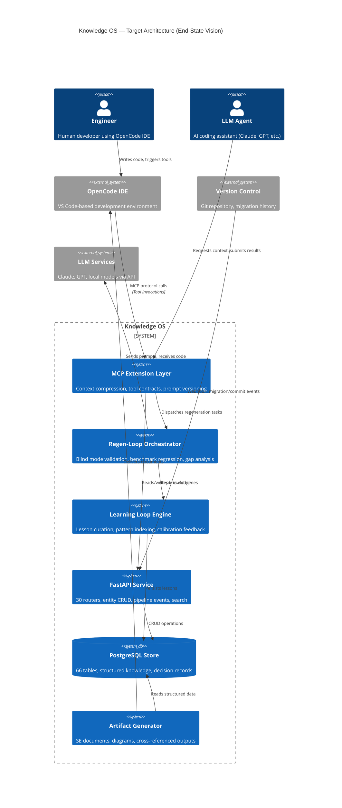
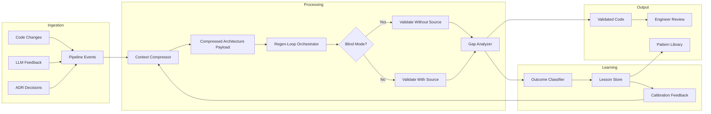
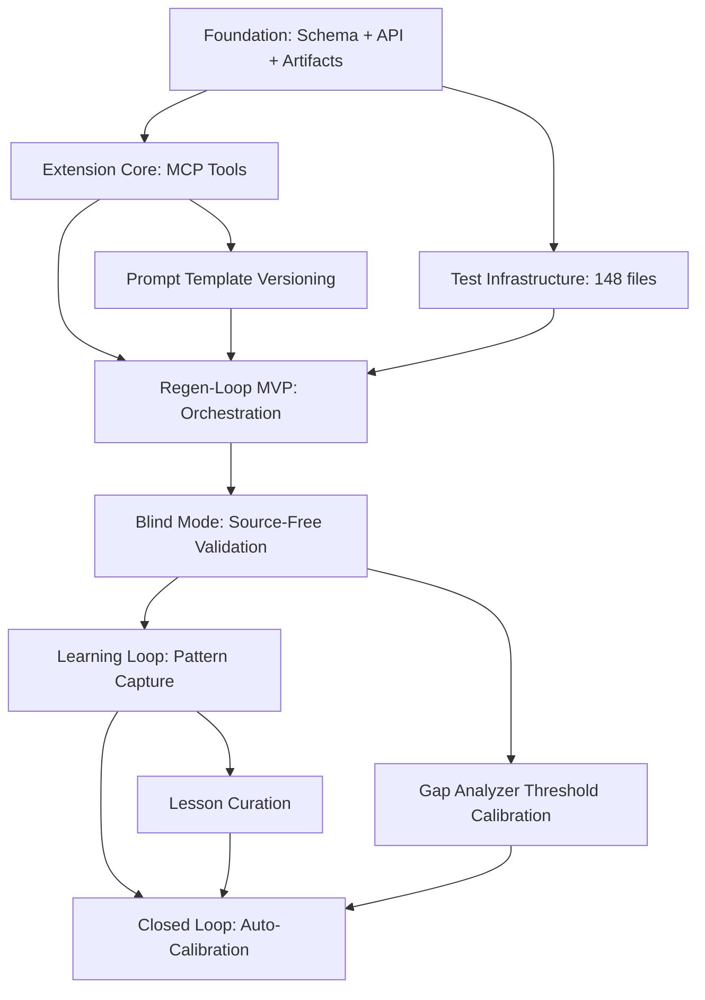

# System Vision

| Field | Value |
|---|---|
| Version | 1.0-draft |
| Date | 2026-07-08 |
| Project | OpenCode Architecture Extension |
| System | Knowledge OS (logs\_db) |
| Author | [TBD] |

## Revision History

| Version | Date | Description |
|---|---|---|
| 1.0-draft | 2026-07-08 | Initial draft from automated analysis |

## Project Profile: OpenCode Architecture Extension
Status: active | Type: new-build | Category: Developer Tooling / AI-Assisted Engineering

OpenCode MCP extension providing architecture context compression, validation tools, regen-loop orchestrator with blind mode, and learning loop for LLM-driven code regeneration.

### Live System Metrics (auto-generated at artifact build time)

| Metric | Value |
|---|---|
| Total logs | 0 |
| Database tables | 66 |
| Latest migration | 056 |
| Python source files | 448 |
| API routers | 30 |
| SQLAlchemy models | 30 |
| HTML templates | 18 |
| Test files | 148 |

---

## 1. Mission Statement

**Knowledge OS exists to serve as the authoritative, structured memory layer for LLM-driven engineering workflows** — capturing decisions, context, signals, and artifacts so that AI agents and human engineers operate from shared, compressed, validated truth rather than stale assumptions or lost context.

The system solves three interconnected problems:

1. **Context Evaporation** — LLM sessions are stateless; architectural decisions, rationale, and project state vanish between interactions. Knowledge OS persists and compresses this context into retrievable, structured form.

2. **Regeneration Drift** — When LLMs regenerate code without validated architectural constraints, output quality degrades across iterations. The regen-loop orchestrator with blind mode provides guardrails that maintain coherence across regeneration cycles.

3. **Learning Stagnation** — Without feedback loops, repeated LLM interactions make the same mistakes. The learning loop captures failure patterns, successful interventions, and calibration data to improve future generations.

The aspiration: **every engineering decision is traceable, every regeneration is validated, and the system continuously improves its own effectiveness as a context provider.**

---

## 2. Current State

### 2.1 Maturity Assessment

| Dimension | Maturity | Evidence |
|---|---|---|
| Data Model | Established | 66 tables, migration 056, 30 SQLAlchemy models |
| API Surface | Established | 30 routers covering entity CRUD and pipeline operations |
| Test Coverage | Growing | 148 test files across unit/integration/system categories |
| Architecture Documentation | Active | 35+ SE process definitions, cross-referenced artifact system |
| OpenCode Extension | Early | Process stubs exist for MCP-specific capabilities (context compression, blind mode, gap analysis) |
| Learning Loop | Nascent | Process defined; curation and feedback mechanisms [TBD] |

### 2.2 Existing Capabilities

The system currently delivers:

- **Structured Knowledge Persistence** — Logs, entities, relationships, technologies, projects, and pipeline events stored in a normalized PostgreSQL schema with 66 tables.
- **FastAPI Service Layer** — 30 API routers exposing CRUD operations, search, and pipeline integrations.
- **Systems Engineering Artifact Generation** — Automated production of ADRs, data dictionaries, deployment guides, functional/logical architecture documents, and 30+ other SE artifacts.
- **Pipeline Event Tracking** — Ingestion of LLM feedback records, codebase exploration logs, and migration history.
- **Template-Driven Presentation** — 18 HTML templates for human-readable artifact rendering.

### 2.3 Extension Capabilities (In Development)

Seven MCP-specific processes have been identified but lack detailed implementation evidence:

| Process | Purpose | Status |
|---|---|---|
| Context Compression Tuning | Optimize architecture context payloads for token efficiency | Defined |
| E2E Benchmark Regression Review | Detect quality regression across regeneration cycles | Defined |
| Gap Analyzer Threshold Calibration | Tune sensitivity of architectural gap detection | Defined |
| Learning Loop Lesson Curation | Capture and index successful/failed patterns | Defined |
| MCP Tool Contract Synchronization | Keep tool schemas aligned with implementation | Defined |
| Prompt Template Versioning | Version-control prompt templates with rollback | Defined |
| Regen Loop Blind Mode Validation | Validate regeneration output without source visibility | Defined |

---

## 3. Target Architecture

### Target State Data Flow

---

## 4. Design Principles

| # | Principle | Rationale | Implication |
|---|---|---|---|
| 1 | **Structured Memory Over Raw Logs** | LLMs need compressed, typed context — not unstructured text dumps. | All knowledge enters through typed schemas with explicit relationships. The 66-table model enforces this. |
| 2 | **Validate Before Commit** | Regenerated code must prove architectural compliance before entering the codebase. | The regen-loop orchestrator gates all LLM output through validation (including blind mode). |
| 3 | **Compression is a First-Class Concern** | Token budgets are real constraints; wasted context degrades output quality. | Context compression tuning is a continuous process, not a one-time optimization. |
| 4 | **Closed Feedback Loops** | Systems that cannot learn from their failures plateau. | Every regeneration outcome feeds the learning loop; lessons are indexed and influence future prompts. |
| 5 | **Traceability Everywhere** | Decisions without recorded rationale become technical debt. | ADRs, signal paths, and the requirements traceability matrix are mandatory, not optional. |
| 6 | **Blind Mode as Quality Signal** | If regenerated code cannot pass validation without access to the original source, the architecture context is insufficient. | Blind mode failures trigger context compression tuning, not just code fixes. |
| 7 | **Documentation as Communication** | In solo-developer and AI-augmented workflows, artifacts replace meetings. | The 35+ SE processes produce living documents that serve as the communication channel. |
| 8 | **Schema-Driven Evolution** | The database schema is the system's backbone; migrations are the audit trail. | All capability additions begin with schema design (Alembic migrations) before implementation. |

---

## 5. Capability Roadmap

> For detailed timeline, milestones, and sprint-level planning, see **Product Roadmap**.

### Capability Evolution

| Phase | Capabilities | Key Deliverables | Dependencies |
|---|---|---|---|
| **Foundation** (Current) | Structured persistence, API surface, artifact generation, pipeline tracking | 66-table schema, 30 routers, 148 test files, 30 models | PostgreSQL, FastAPI, Alembic |
| **Extension Core** | MCP tool contracts, basic context compression, prompt template versioning | MCP protocol integration, tool schema registry, template version store | OpenCode MCP SDK, tool contract spec |
| **Regen-Loop MVP** | Regeneration orchestration, standard validation mode, benchmark baseline | Orchestrator service, validation pipeline, E2E benchmark suite | Extension Core complete |
| **Blind Mode** | Source-free validation, gap analysis, threshold calibration | Blind validator, gap analyzer with configurable thresholds | Regen-Loop MVP, sufficient benchmark data |
| **Learning Loop** | Outcome classification, lesson persistence, pattern indexing | Lesson store schema, classifier model, pattern query API | Blind Mode operational, outcome data accumulated |
| **Closed Loop** | Calibration feedback, automatic context compression tuning, regression detection | Feedback pipeline, auto-tuning service, regression alert system | Learning Loop, 30+ days of outcome data |

### Capability Dependency Graph

---

## 6. Success Criteria

### 6.1 Quantitative Measures

| Criterion | Baseline (Current) | Target | Measurement Method |
|---|---|---|---|
| Context payload token efficiency | [TBD] | ≥40% reduction vs. raw dump | Token count comparison: compressed vs. uncompressed |
| Regen-loop validation pass rate | N/A (not operational) | ≥80% first-pass | Outcome classifier: pass/fail ratio |
| Blind mode pass rate | N/A | ≥70% (indicating context sufficiency) | Blind validator outcomes |
| Learning loop lesson reuse rate | N/A | ≥50% of lessons applied within 30 days | Lesson query frequency vs. creation date |
| Regression detection latency | N/A | <1 regeneration cycle | E2E benchmark comparison timing |
| Schema coverage (tables with documentation) | [TBD] | 100% of 66 tables | Data Dictionary completeness audit |
| Test file coverage ratio | 148 / 448 source files (33%) | ≥60% | Test file count / source file count |

### 6.2 Qualitative Indicators

| Indicator | Evidence |
|---|---|
| Engineers trust regenerated code | Reduced manual review time per regen cycle |
| Architecture decisions persist across sessions | ADR creation rate stable; no repeated decisions |
| Context compression improves autonomously | Tuning interventions decrease over time |
| System documentation stays current | Artifact generation timestamps within 7 days of schema changes |

### 6.3 Anti-Goals (Explicit Non-Targets)

| Anti-Goal | Rationale |
|---|---|
| Replace human architectural judgment | The system provides context and validates; humans decide |
| Achieve 100% autonomous regeneration | Blind mode is a quality signal, not an autonomy target |
| Minimize database schema size | Richness of the model (66 tables) is a feature, not a cost |
| Support arbitrary LLM providers equally | Optimize for primary toolchain; abstract where practical |

---

## Cross-References

| Artifact | Relevance |
|---|---|
| Product Roadmap | Timeline details, sprint plans, milestone dates |
| Functional Architecture | Detailed functional block decomposition |
| Logical Architecture | Technology allocation and component mapping |
| Data Dictionary | Complete schema documentation (66 tables, 30 models) |
| System Context Diagram | External actor boundaries and interface inventory |
| Requirements Analysis | Traceable requirements driving capability phases |
| ADRs | Decision records for architectural choices referenced herein |