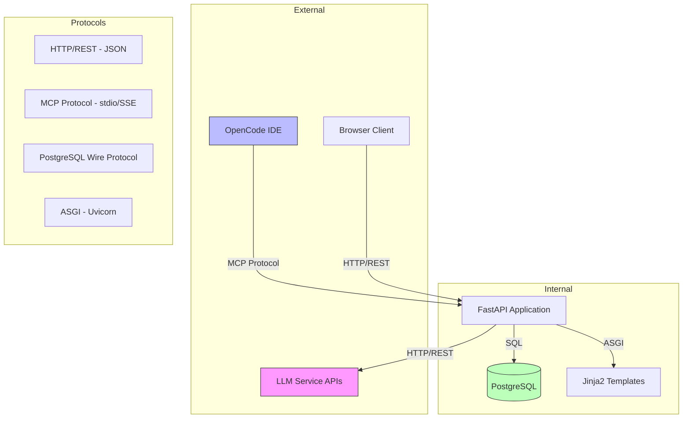
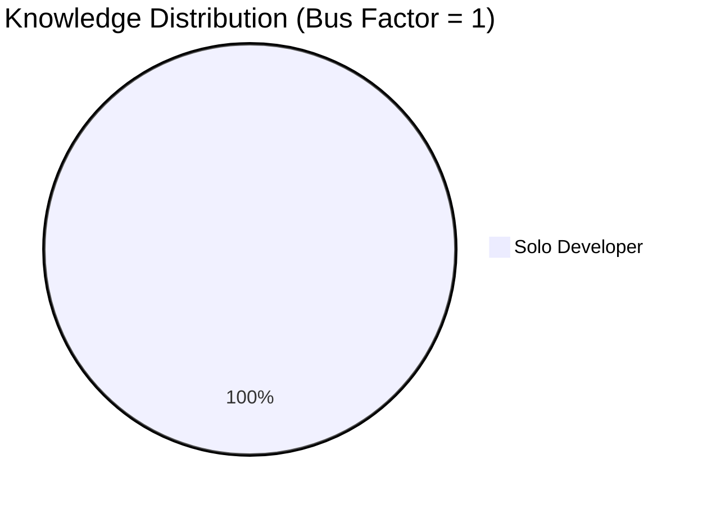
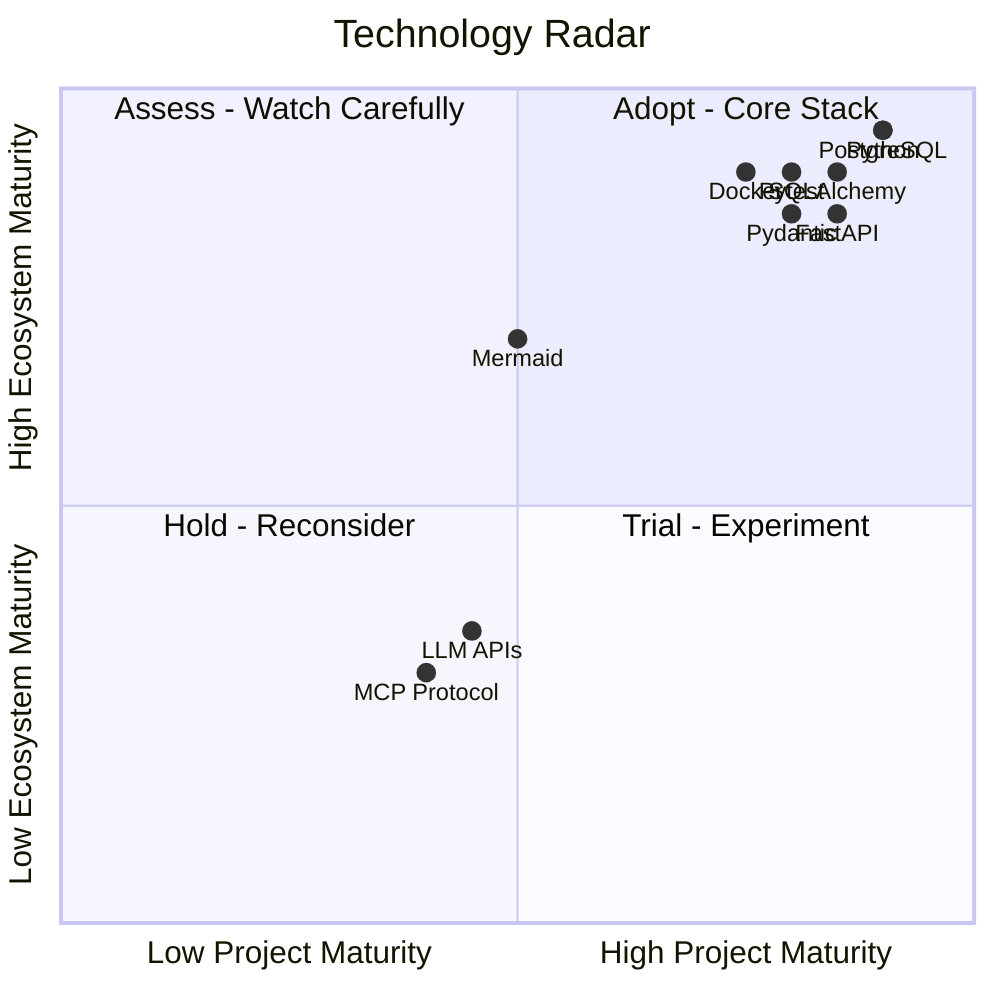

# Technology Radar

| Field | Value |
|---|---|
| Version | 1.0-draft |
| Date | 2026-07-08 |
| Project | OpenCode Architecture Extension |
| System | N/A |
| Author | TBD |

## Revision History

| Version | Date | Description |
|---|---|---|
| 1.0-draft | 2026-07-08 | Initial draft from automated analysis |

## Project Profile: OpenCode Architecture Extension
Status: active | Type: new-build | Category: Developer Tooling / AI-Assisted Engineering

OpenCode MCP extension providing architecture context compression, validation tools, regen-loop orchestrator with blind mode, and learning loop for LLM-driven code regeneration.

### Live System Metrics (auto-generated at artifact build time)

| Metric | Value |
|---|---|
| Total logs | 0 |
| Database tables | 66 |
| Latest migration | 056 |
| Python source files | 448 |
| Test files | 148 |
| API routers | 30 |
| SQLAlchemy models | 30 |
| HTML templates | 18 |

---

## 1. Technology Inventory

The following technologies are identified from the project's source material, architecture documents, and process definitions. Technologies are classified by ring (Adopt, Trial, Assess, Hold) following the ThoughtWorks radar model adapted for this project's context.

| Technology | Category | Ring | Rationale | Single-Person Dependency Risk |
|---|---|---|---|---|
| Python 3.x | Language | Adopt | Primary implementation language; 448 source files | Yes — Solo developer |
| FastAPI | Framework | Adopt | Web framework for all 30 API routers | Yes — Solo developer |
| SQLAlchemy | ORM / Data Access | Adopt | 30 models mapped to 66 database tables | Yes — Solo developer |
| PostgreSQL | Database | Adopt | Primary persistence layer for Knowledge OS | Yes — Solo developer |
| Alembic | Migration Tool | Adopt | 56 migrations managing schema evolution | Yes — Solo developer |
| Pydantic | Validation / Schema | Adopt | Request/response validation, data contracts | Yes — Solo developer |
| Pytest | Testing Framework | Adopt | 148 test files; primary test runner | Yes — Solo developer |
| Uvicorn | ASGI Server | Adopt | Production server for FastAPI application | Yes — Solo developer |
| Docker / Docker Compose | Containerization | Adopt | Deployment and service orchestration | Yes — Solo developer |
| Jinja2 / HTML Templates | Templating | Adopt | 18 HTML templates for UI rendering | Yes — Solo developer |
| MCP (Model Context Protocol) | Protocol | Trial | Extension integration protocol for OpenCode | Yes — Solo developer |
| LLM APIs (external) | AI Service | Trial | Code regeneration, context compression | Yes — Solo developer |
| Mermaid | Documentation | Trial | Architecture diagrams in documentation artifacts | Yes — Solo developer |
| Markdown | Documentation | Adopt | All documentation artifacts | Yes — Solo developer |
| Git | Version Control | Adopt | Source control and configuration management | Yes — Solo developer |

---

## 2. Protocol Stack

Communication protocols identified across system boundaries. See ICD artifact for complete interface specifications.

| Layer | Protocol | Format | Direction | Notes |
|---|---|---|---|---|
| Client ↔ API | HTTP/1.1 REST | JSON | Bidirectional | 30 API routers exposed |
| IDE ↔ Extension | MCP (Model Context Protocol) | JSON-RPC over stdio/SSE | Bidirectional | OpenCode integration point |
| API ↔ Database | PostgreSQL wire protocol | SQL / Binary | Bidirectional | SQLAlchemy async sessions |
| API ↔ LLM | HTTPS REST | JSON | Request/Response | External AI service dependency |
| API ↔ Browser | HTTP/1.1 | HTML (Jinja2-rendered) | Response | 18 template-driven views |
| Deployment | Docker networking | TCP | Internal | Container-to-container communication |

---

## 3. Expertise Coverage

### Current Knowledge Distribution

Given the solo-developer resource model (see Resource Management artifact), all technologies carry single-person dependency risk.

| Technology Domain | Primary Expert | Backup | Risk Level |
|---|---|---|---|
| Python / FastAPI / SQLAlchemy | Solo Developer | None | 🔴 Critical |
| PostgreSQL / Alembic Migrations | Solo Developer | None | 🔴 Critical |
| MCP Protocol Integration | Solo Developer | None | 🔴 Critical |
| LLM API Integration | Solo Developer | None | 🔴 Critical |
| Testing (Pytest) | Solo Developer | None | 🟡 High |
| Docker / Deployment | Solo Developer | None | 🟡 High |
| Documentation Tooling | Solo Developer | None | 🟢 Medium |

### Bus Factor Analysis

**Assessment:** The project has a bus factor of 1 across all technology domains. This is acknowledged as an accepted risk given the project's nature as a solo-developer knowledge management system. Mitigation strategies include:

1. Comprehensive documentation artifacts (this radar + 40+ SE process documents)
2. LLM-assisted knowledge capture in the system itself
3. Architecture decision records preserving rationale
4. Target onboarding time < 1 day for future contributors (see Requirements Analysis)

---

## 4. Maturity Assessment

### Technology Maturity Matrix

| Technology | Ecosystem Maturity | Project Maturity | Version Currency | Recommendation |
|---|---|---|---|---|
| Python 3.x | Stable | Stable | [TBD - specific version] | Maintain current |
| FastAPI | Stable | Stable | [TBD] | Maintain current |
| SQLAlchemy | Stable | Stable | [TBD] | Maintain current |
| PostgreSQL | Stable | Stable | [TBD] | Maintain current |
| Alembic | Stable | Stable | 56 migrations applied | Maintain current |
| Pydantic | Stable | Stable | [TBD - v1 vs v2] | Verify v2 migration status |
| Pytest | Stable | Stable | 148 test files | Maintain current |
| Uvicorn | Stable | Stable | [TBD] | Maintain current |
| Docker | Stable | Stable | [TBD] | Maintain current |
| MCP | Emerging | Trial | [TBD] | Monitor specification evolution |
| LLM APIs | Emerging | Trial | [TBD] | Monitor for breaking changes |
| Mermaid | Stable | Emerging | [TBD] | Expand usage in documentation |

### Radar Visualization

---

## 5. Technology Risk Register

| Risk ID | Technology | Risk Description | Likelihood | Impact | Mitigation |
|---|---|---|---|---|---|
| TR-001 | MCP Protocol | Specification instability; breaking changes in protocol | Medium | High | Pin to known-good version; abstract behind interface layer |
| TR-002 | LLM APIs | External service dependency; rate limits, deprecation, pricing changes | High | High | Provider abstraction layer; fallback providers; cost monitoring (see Cost Management) |
| TR-003 | All | Single-person dependency across entire stack | High | Critical | Documentation-as-mitigation; automated artifact generation; learning loop captures decisions |
| TR-004 | Pydantic | v1→v2 migration compatibility | Low | Medium | [TBD - verify current version] |
| TR-005 | PostgreSQL | Schema complexity (66 tables, 56 migrations) | Low | Medium | Alembic migration discipline; schema documentation (see Data Dictionary) |

---

## 6. Adoption Recommendations

### Adopt (Use in production with confidence)

| Technology | Action | Timeline |
|---|---|---|
| Python / FastAPI / SQLAlchemy | Continue as core stack | Ongoing |
| PostgreSQL + Alembic | Continue as primary persistence | Ongoing |
| Pytest | Expand coverage toward comprehensive regression | Ongoing |
| Docker | Maintain deployment containerization | Ongoing |
| Pydantic | Ensure v2 alignment | Next sprint |

### Trial (Use in production with active evaluation)

| Technology | Action | Evaluation Criteria | Review Date |
|---|---|---|---|
| MCP Protocol | Monitor spec stability; maintain abstraction layer | Protocol stability, community adoption | [TBD] |
| LLM APIs | Evaluate cost/performance; maintain provider abstraction | Cost per call, latency, accuracy | [TBD] |
| Mermaid | Expand to all architecture documentation | Rendering support, maintainability | [TBD] |

### Assess (Research and prototype only)

| Technology | Action | Notes |
|---|---|---|
| [TBD] | No technologies currently in assess ring | Revisit when new capabilities are needed |

### Hold (Do not invest further; plan migration if in use)

| Technology | Action | Notes |
|---|---|---|
| [TBD] | No technologies currently in hold ring | Stack is relatively modern |

---

## 7. Standardization Guidelines

### Mandatory Stack

All new features MUST use:
- **Language:** Python 3.x
- **Web Framework:** FastAPI
- **ORM:** SQLAlchemy (async)
- **Validation:** Pydantic v2
- **Testing:** Pytest
- **Migrations:** Alembic
- **Deployment:** Docker Compose

### Technology Selection Criteria

When evaluating new technology additions (see Procurement Management for full make-or-buy criteria):

1. **Compatibility** — Must integrate with existing Python/FastAPI stack
2. **Solo-maintainability** — Must be maintainable by a single developer
3. **Documentation quality** — Must have sufficient docs for LLM-assisted maintenance
4. **License compliance** — Must be compatible with project licensing
5. **Community health** — Active maintenance, responsive to security issues

---

## 8. Cross-References

| Artifact | Relevance |
|---|---|
| Data Dictionary | Schema details for PostgreSQL/SQLAlchemy layer |
| ICD | Complete interface specifications and protocol details |
| Logical Architecture | Technology-to-component mapping |
| Deployment Guide | Docker/infrastructure configuration |
| Resource Management | Staffing implications of technology choices |
| Procurement Management | Make-or-buy decisions, license compliance |
| Risk Management | Full risk register including technology risks |
| Quality Management | Test coverage and code quality standards |

---

## 9. Review Schedule

| Review Type | Frequency | Next Review |
|---|---|---|
| Full radar refresh | Quarterly | [TBD] |
| Emerging tech assessment (MCP, LLM) | Monthly | [TBD] |
| Dependency security audit | [TBD] | [TBD] |
| Version currency check | [TBD] | [TBD] |

---

*End of document. This Technology Radar should be reviewed whenever new technologies are introduced or existing ones reach deprecation milestones.*