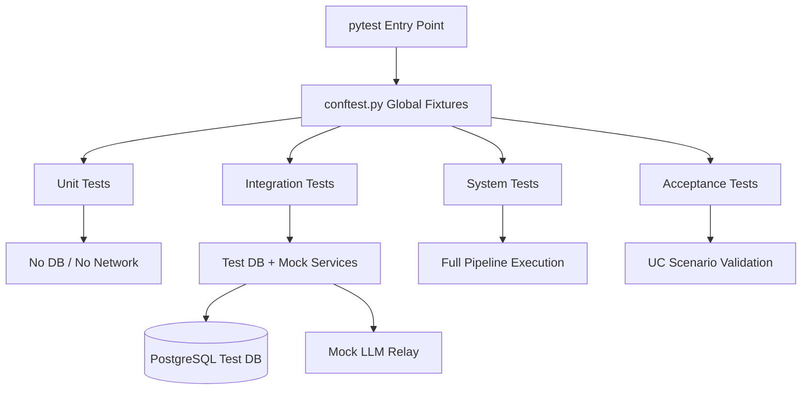
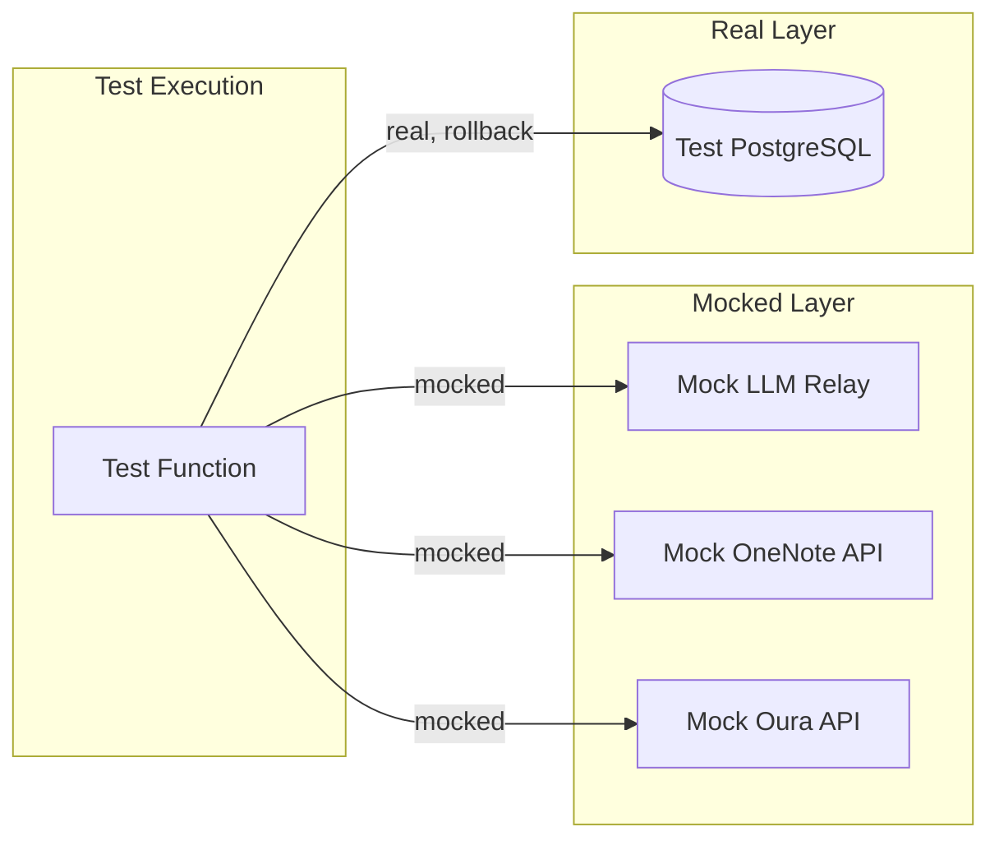

# Test Strategy & Report

| Field | Value |
|---|---|
| Version | 1.0-draft |
| Date | 2026-07-08 |
| Project | OpenCode Architecture Extension |
| System | Knowledge OS (logs-db) |
| Author | TBD |

## Revision History

| Version | Date | Description |
|---|---|---|
| 1.0-draft | 2026-07-08 | Initial draft from automated analysis |

---

## 1. Test Architecture

### Framework & Tooling

| Component | Technology | Status |
|---|---|---|
| Test Framework | pytest 7.x+ with pytest-asyncio | [ACTIVE] |
| HTTP Testing | httpx AsyncClient / TestClient | [ACTIVE] |
| Database Testing | PostgreSQL test database (isolated) | [ACTIVE] |
| Coverage Tool | pytest-cov | [ACTIVE] |
| CI Integration | [TBD] | [PLANNED] |
| Mocking | unittest.mock / pytest-mock | [ACTIVE] |

### Directory Structure

The test suite mirrors the source structure under `tests/`:

```
tests/
├── conftest.py              # Global fixtures (DB session, TestClient, mock LLM)
├── unit/                    # Pure function tests, no external deps
│   ├── test_enrichment/     # F2 enrichment logic
│   ├── test_parsers/        # F1 parser utilities
│   └── test_validators/     # F5 schema validators
├── integration/             # Tests requiring DB or service mocks
│   ├── test_api/            # F4 endpoint tests
│   ├── test_ingest/         # F1 source ingestion
│   ├── test_kb/             # F3 knowledge base CRUD
│   └── test_migrations/     # F5 Alembic migration tests
├── system/                  # End-to-end workflow tests
│   └── test_pipelines/      # Multi-stage pipeline tests
└── acceptance/              # UC-driven acceptance scenarios
    └── test_use_cases/      # Mapped to UC-01 through UC-30
```

### Naming Conventions

| Element | Convention | Example |
|---|---|---|
| Test files | `test_<module>.py` | `test_log_parser.py` |
| Test functions | `test_<behavior>_<condition>` | `test_enrich_log_returns_tags_when_valid` |
| Fixtures | `<resource>_fixture` or descriptive | `db_session`, `mock_llm_client` |
| Parameterized IDs | `<scenario_name>` | `@pytest.mark.parametrize(..., ids=["empty_input", "unicode"])` |



---

## 2. Test Categories

### Category Allocation by F-Block

| F-Block | Category | Scope | Key Validations |
|---|---|---|---|
| F1 — Ingest Source Data | Integration | Source parsers, OneNote/OpenCode ingestion, scheduled scans | Parse fidelity, deduplication on ingest, error handling for malformed input |
| F2 — Enrich Log Entities | Unit | Enrichment functions with mocked LLM responses | Tag normalization, module extraction, LLM response parsing |
| F3 — Manage Knowledge Base | Integration | KB CRUD operations, entity derivation, deduplication | Create/read/update/delete KB entities, derivation logic, quality audit |
| F4 — Serve API & UI | Integration | API endpoints via httpx TestClient | Response codes, payload schemas, pagination, auth boundaries |
| F5 — Maintain Data Integrity | Integration + Unit | Migration correctness, schema validation, embedding backfill | Alembic up/down consistency, constraint enforcement, data type validation |
| F6 — Generate Documentation | Unit + Integration | Artifact generation, template rendering | Template correctness, Mermaid output validity, cross-reference integrity |

### Category Definitions

**Unit Tests** — Isolated function-level tests. No database, no network. All external dependencies are mocked. Target: F2 enrichment logic, F5 validators, F6 template functions.

**Integration Tests** — Require a running test database and/or mock services. Validate component interactions across module boundaries. Target: F1 parsers writing to DB, F3 CRUD operations, F4 API routes.

**System Tests** — End-to-end pipeline tests exercising multiple F-blocks in sequence (e.g., ingest → enrich → store → serve). Require full test environment.

**Acceptance Tests** — Mapped directly to Use Cases (UC-01 through UC-30). Verify that user-observable behavior matches requirements. Structure mirrors UC catalog from the architecture model.

---

## 3. Mocking Strategy

### External Dependency Isolation

| Dependency | Mock Approach | Fixture Name | Scope |
|---|---|---|---|
| LLM Relay (copilot-relay) | `unittest.mock.AsyncMock` returning canned responses | `mock_llm_client` | Session |
| Ollama (local LLM) | `unittest.mock.patch` on HTTP client | `mock_ollama` | Function |
| PostgreSQL | Dedicated test database with transaction rollback | `db_session` | Function |
| OneNote API | Response fixtures (JSON files) | `mock_onenote_response` | Function |
| Oura Health API | Response fixtures (JSON files) | `mock_oura_response` | Function |
| File System (source scan) | `tmp_path` fixture with seeded files | `source_tree` | Function |

### Mock Design Principles

1. **Transaction rollback pattern** — Each integration test runs within a transaction that is rolled back after assertion, ensuring test isolation without database recreation overhead.

2. **Canned LLM responses** — Stored as JSON fixtures in `tests/fixtures/llm_responses/`. Each fixture is version-tagged to match prompt template versions.

3. **No real network calls** — All HTTP-dependent tests use `respx` or `unittest.mock.patch` to intercept outbound requests. CI environments have no external network access.

4. **Database state seeding** — Factory functions (`tests/factories/`) produce valid model instances using `factory_boy` patterns for deterministic test data.



---

## 4. Test Design Patterns

### Fixture Hierarchy

```python
# conftest.py (root)
@pytest.fixture(scope="session")
async def test_engine():
    """Create test database engine once per session."""

@pytest.fixture(scope="function")
async def db_session(test_engine):
    """Provide transactional session, rolled back after each test."""

@pytest.fixture(scope="session")
def app(test_engine):
    """FastAPI app with overridden DB dependency."""

@pytest.fixture(scope="session")
def client(app):
    """httpx AsyncClient bound to test app."""
```

### Parameterization Strategy

Tests covering multiple input scenarios use `@pytest.mark.parametrize` with explicit IDs:

- **Parser tests** — parameterized across source formats (markdown, JSON, plain text)
- **Enrichment tests** — parameterized across LLM response variants (success, partial, malformed, timeout)
- **API tests** — parameterized across HTTP methods and auth states

### Markers

| Marker | Purpose |
|---|---|
| `@pytest.mark.asyncio` | Async test functions |
| `@pytest.mark.integration` | Requires test DB |
| `@pytest.mark.slow` | Execution > 5s, excluded from fast CI |
| `@pytest.mark.llm` | Requires LLM mock fixtures |

---

## 5. Coverage Report

### Current Test Inventory

| Metric | Value | Source |
|---|---|---|
| Total test files | 148 | Live System Metrics |
| Total Python source files | 448 | Live System Metrics |
| Test-to-source ratio | 0.33 | Computed (148/448) |
| Total test functions | [TBD] | Requires pytest collection |
| Overall pass rate | [TBD] | Requires CI run |
| Line coverage | [TBD] | Requires pytest-cov execution |

### Coverage by F-Block (Estimated from Manifest)

| F-Block | Source Files (est.) | Test Files (est.) | Coverage Status |
|---|---|---|---|
| F1 — Ingest Source Data | ~75 | ~25 | [TBD] |
| F2 — Enrich Log Entities | ~50 | ~20 | [TBD] |
| F3 — Manage Knowledge Base | ~80 | ~30 | [TBD] |
| F4 — Serve API & UI | ~120 | ~40 | [TBD] |
| F5 — Maintain Data Integrity | ~60 | ~18 | [TBD] |
| F6 — Generate Documentation | ~63 | ~15 | [TBD] |

> **Note:** The code-grounded manifest reported "No test files found in scanned modules," indicating the manifest scan scope did not include `tests/`. The system metrics confirm 148 test files exist. Detailed per-file coverage mapping requires a full `pytest --cov` execution.

---

## 6. Test Matrix

| TC-ID | F-Block | Component | REQ-F Coverage | UC Coverage | Test File Pattern | Test Count | Key Scenarios |
|---|---|---|---|---|---|---|---|
| TC-001 | F1 | OneNote Parser | REQ-F-101, REQ-F-102 | UC-01 | `tests/integration/test_ingest/test_onenote_*` | [TBD] | Valid journal parse, malformed HTML handling, duplicate detection |
| TC-002 | F1 | OpenCode Session Parser | REQ-F-103, REQ-F-104 | UC-02 | `tests/integration/test_ingest/test_opencode_*` | [TBD] | Session boundary detection, multi-file extraction, encoding errors |
| TC-003 | F1 | Scheduled Scanner | REQ-F-105 | UC-03 | `tests/integration/test_ingest/test_scheduler_*` | [TBD] | Cron trigger, idempotent re-scan, source path resolution |
| TC-004 | F1 | Folder Intelligence | REQ-F-106 | UC-04 | `tests/integration/test_ingest/test_folder_*` | [TBD] | Directory traversal, ignore patterns, metadata extraction |
| TC-005 | F1 | Oura Health Sync | REQ-F-107 | UC-05 | `tests/integration/test_ingest/test_oura_*` | [TBD] | API response mapping, rate limiting, partial sync resume |
| TC-006 | F2 | LLM Enrichment | REQ-F-201, REQ-F-202 | UC-06 | `tests/unit/test_enrichment/test_llm_*` | [TBD] | Valid enrichment, LLM timeout, malformed response, retry logic |
| TC-007 | F2 | Tag Normalizer | REQ-F-203 | UC-07 | `tests/unit/test_enrichment/test_tags_*` | [TBD] | Case normalization, alias resolution, duplicate merge |
| TC-008 | F2 | Module Extractor | REQ-F-204 | UC-08 | `tests/unit/test_enrichment/test_modules_*` | [TBD] | Code block detection, language identification, naming |
| TC-009 | F3 | KB Entity Derivation | REQ-F-301 | UC-09 | `tests/integration/test_kb/test_derive_*` | [TBD] | Entity creation from logs, relationship linking, conflict resolution |
| TC-010 | F3 | Seed/Sync KB | REQ-F-302 | UC-10 | `tests/integration/test_kb/test_seed_*` | [TBD] | Initial seed, incremental sync, schema mismatch handling |
| TC-011 | F3 | Task Deduplication | REQ-F-303 | UC-11 | `tests/integration/test_kb/test_dedup_*` | [TBD] | Exact match, fuzzy match, merge strategy |
| TC-012 | F3 | Project Reclassification | REQ-F-304 | UC-12 | `tests/integration/test_kb/test_reclass_*` | [TBD] | Category reassignment, cascade update, audit trail |
| TC-013 | F3 | KB Quality Audit | REQ-F-305 | UC-13 | `tests/integration/test_kb/test_audit_*` | [TBD] | Staleness detection, completeness scoring, report generation |
| TC-014 | F4 | Log Browse/Filter API | REQ-F-401 | UC-14 | `tests/integration/test_api/test_logs_*` | [TBD] | Pagination, date filtering, tag filtering, empty results |
| TC-015 | F4 | CRUD Entities API | REQ-F-402 | UC-15 | `tests/integration/test_api/test_entities_*` | [TBD] | Create, read, update, delete, validation errors, 404 handling |
| TC-016 | F4 | Vector Search API | REQ-F-403 | UC-16 | `tests/integration/test_api/test_search_*` | [TBD] | Semantic query, relevance ranking, empty embeddings fallback |
| TC-017 | F4 | LLM Feedback API | REQ-F-404 | UC-17 | `tests/integration/test_api/test_feedback_*` | [TBD] | Accept flow, reject flow, feedback persistence |
| TC-018 | F4 | Dashboard API | REQ-F-405 | UC-18 | `tests/integration/test_api/test_dashboard_*` | [TBD] | Metric aggregation, date range, widget data contracts |
| TC-019 | F4 | Entity Comments API | REQ-F-406 | UC-19 | `tests/integration/test_api/test_comments_*` | [TBD] | Create comment, thread retrieval, deletion |
| TC-020 | F4 | Artifact Patches API | REQ-F-407 | UC-20 | `tests/integration/test_api/test_patches_*` | [TBD] | Patch creation, application, conflict detection |
| TC-021 | F4 | Flashcards API | REQ-F-408 | UC-21 | `tests/integration/test_api/test_flashcards_*` | [TBD] | Card generation, spaced repetition scheduling |
| TC-022 | F5 | Embedding Backfill | REQ-F-501 | UC-22 | `tests/integration/test_migrations/test_embed_*` | [TBD] | Batch processing, idempotency, dimension validation |
| TC-023 | F5 | Schema Migrations | REQ-F-502 | UC-23 | `tests/integration/test_migrations/test_alembic_*` | [TBD] | Up/down consistency across 56 migrations, no data loss |
| TC-024 | F5 | Training Data Collection | REQ-F-503 | UC-24 | `tests/integration/test_migrations/test_training_*` | [TBD] | Format compliance, deduplication, privacy filtering |
| TC-025 | F6 | Architecture Artifacts | REQ-F-601 | UC-25 | `tests/unit/test_generators/test_artifact_*` | [TBD] | Template rendering, Mermaid validity, metric injection |
| TC-026 | F6 | Entity Graph Builder | REQ-F-602 | UC-26 | `tests/unit/test_generators/test_graph_*` | [TBD] | Node creation, edge linking, cycle detection |

### Coverage for [PLANNED] Use Cases

| TC-ID | F-Block | UC Coverage | Status | Notes |
|---|---|---|---|---|
| TC-027 | F1 | UC-27 (Mobile Log Capture) | [PLANNED] | Pending mobile API design |
| TC-028 | F4 | UC-28 (Conversational Query) | [PLANNED] | Awaiting LLM chat integration |
| TC-029 | F3 | UC-29 (Staleness Detection) | [PLANNED] | Requires scheduling framework |
| TC-030 | F6 | UC-30 (Cross-Project Federation) | [PLANNED] | Multi-tenant design incomplete |

---

## Cross-References

- **Verification & Validation** — See V&V artifact for full requirements traceability matrix (REQ-F → evidence mapping)
- **Requirements Analysis** — Authoritative source for REQ-F-nnn identifiers and acceptance criteria
- **Functional Architecture** — F-block definitions and interface contracts referenced in test categorization
- **Use Cases** — UC-01 through UC-30 behavioral specifications driving acceptance test design