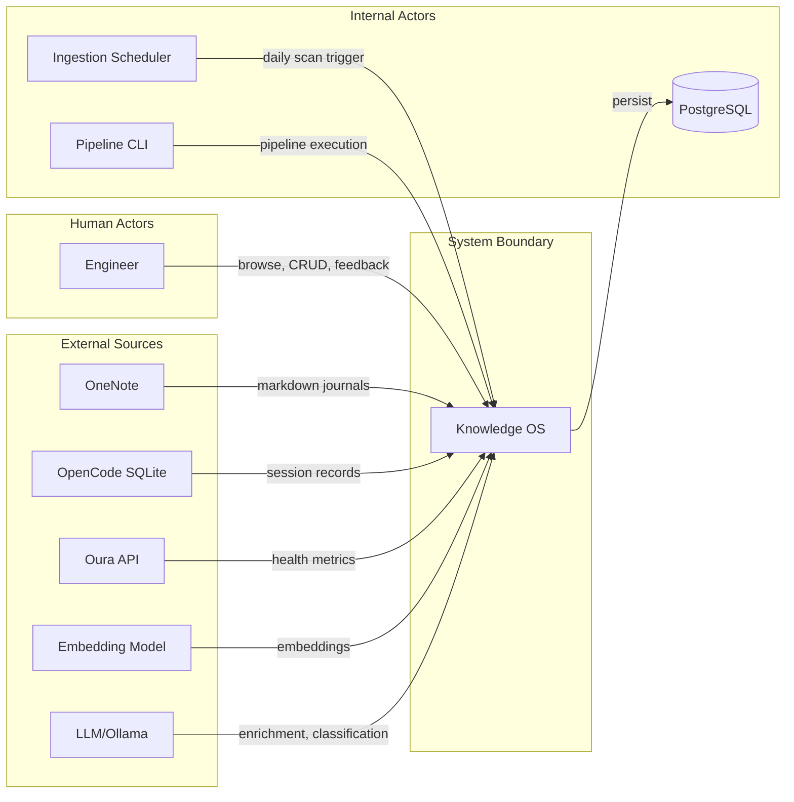
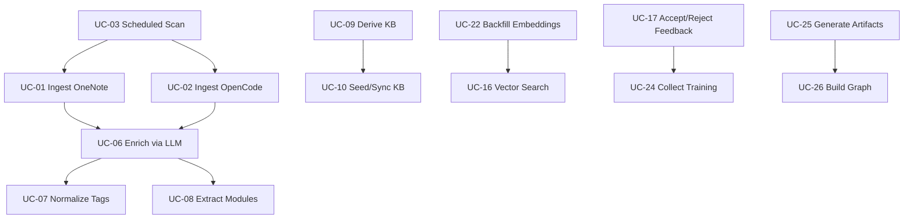
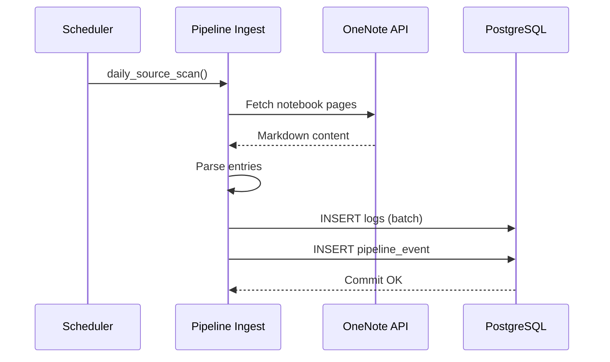
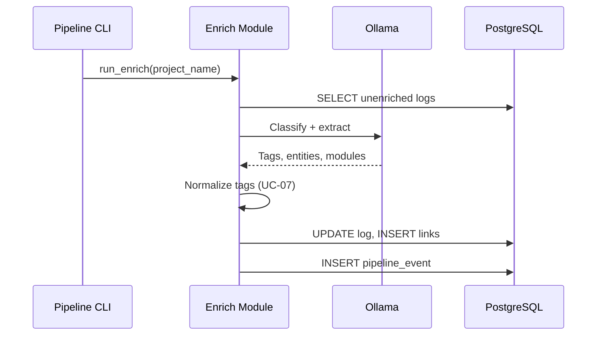
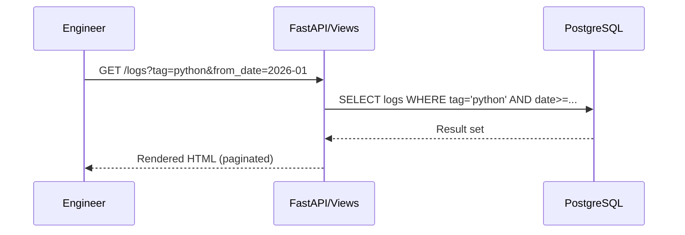
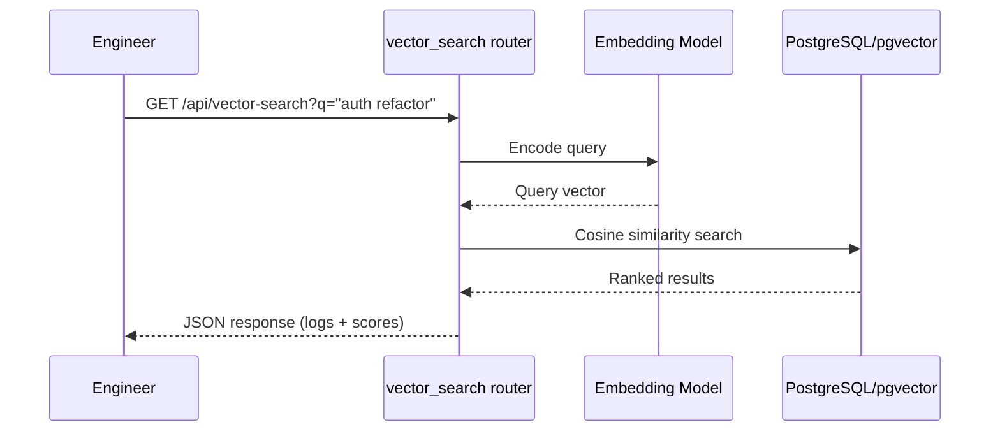

# Use Case Catalog

| Field | Value |
|---|---|
| Version | 1.0-draft |
| Date | 2026-07-08 |
| Project | OpenCode Architecture Extension |
| System | Knowledge OS (logs-db) |
| Author | TBD |

## Revision History

| Version | Date | Description |
|---|---|---|
| 1.0-draft | 2026-07-08 | Initial draft from automated analysis |

---

## 1. Actors & Goals

| Actor ID | Name | Type | Goals |
|---|---|---|---|
| A-01 | Engineer | Human | Capture work logs; browse knowledge; accept/reject LLM suggestions; query history semantically |
| A-02 | Ingestion Scheduler | System | Automatically scan sources daily; trigger enrichment pipelines without manual intervention |
| A-03 | LLM Service | System | Enrich logs with entity links; normalize tags; classify entries |
| A-04 | OneNote | External Service | Provide sprint journal markdown for ingestion |
| A-05 | OpenCode SQLite | External Service | Provide coding session records for ingestion |
| A-06 | PostgreSQL | System | Persist all entities, logs, pipeline events |
| A-07 | Pipeline CLI | System | Execute pipeline stages (ingest, enrich, seed, graph, artifacts) |
| A-08 | Oura API | External Service | Provide daily health/activity metrics for correlation |
| A-09 | Embedding Model | External Service | Generate vector representations for semantic search |

---

## 2. Use Case Catalog

| UC-ID | Actor(s) | Title | F-Block | Status | Priority | Frequency | Acceptance Criteria | Requirement(s) | Realizing Component |
|---|---|---|---|---|---|---|---|---|---|
| UC-01 | A-02, A-04 | Ingest OneNote Journals | F1 | [ACTIVE] | Critical | Daily | Sprint markdown parsed into ≥1 log entry with source=onenote | REQ-F-001 | scripts/_pipeline_ingest.py |
| UC-02 | A-07, A-05 | Ingest OpenCode Sessions | F1 | [ACTIVE] | Critical | On-demand | Session records ingested with source=opencode | REQ-F-002 | scripts/_pipeline_ingest.py |
| UC-03 | A-02 | Scheduled Source Scan | F1 | [ACTIVE] | Critical | Daily | Scheduler triggers daily_source_scan without error | REQ-F-003 | scripts/ingestion/_scheduler.py |
| UC-04 | A-07 | Run Folder Intelligence | F1 | [ACTIVE] | Low | On-demand | Project directory scanned, type detected, README matched | REQ-F-004 | scripts/_pipeline_folder_intel.py |
| UC-05 | A-08 | Sync Oura Health Data | F1 | [ACTIVE] | Medium | Daily | Daily metrics stored and queryable by date range | REQ-F-005 | app/routers/oura.py |
| UC-06 | A-03 | Enrich Logs via LLM | F2 | [ACTIVE] | Critical | Event-driven | Log enriched with tags, entity links; pipeline_event emitted | REQ-F-006 | scripts/_pipeline_enrich.py |
| UC-07 | A-03 | Normalize Tags | F2 | [ACTIVE] | High | Event-driven | Tags deduplicated and canonical form applied | REQ-F-007 | scripts/_pipeline_enrich.py |
| UC-08 | A-03 | Extract Modules | F2 | [ACTIVE] | High | Event-driven | Module references extracted from log text | REQ-F-008 | scripts/_pipeline_enrich.py |
| UC-09 | A-07 | Derive KB Entities | F3 | [ACTIVE] | High | Weekly | New entities discovered and merged into knowledge_base.yaml | REQ-F-009 | scripts/_pipeline_seed.py |
| UC-10 | A-07 | Seed/Sync KB to DB | F3 | [ACTIVE] | High | Weekly | DB reference tables match knowledge_base.yaml | REQ-F-010 | scripts/_pipeline_seed.py |
| UC-11 | A-07 | Deduplicate Tasks | F3 | [ACTIVE] | Medium | On-demand | Duplicate tasks merged, zero orphan records | REQ-F-011 | scripts/_pipeline_synthesize.py |
| UC-12 | A-07 | Reclassify Projects | F3 | [ACTIVE] | Medium | On-demand | Orphaned logs reassigned to valid entities | REQ-F-012 | scripts/_pipeline_seed.py |
| UC-13 | A-07 | Audit KB Quality | F3 | [ACTIVE] | Medium | Weekly | Audit report generated with accuracy score ≥ baseline | REQ-F-013 | scripts/audit_kb_quality.py |
| UC-14 | A-01 | Browse & Filter Logs | F4 | [ACTIVE] | Critical | Daily | Logs page renders with filters; pagination works | REQ-F-014 | app/routers/logs.py, app/routers/views.py |
| UC-15 | A-01 | CRUD Entities | F4 | [ACTIVE] | Critical | Daily | Create/read/update/delete on projects, systems, processes, technologies | REQ-F-015 | app/routers/projects.py, systems.py, processes.py, technologies.py |
| UC-16 | A-01 | Vector Search | F4 | [ACTIVE] | High | On-demand | Semantic query returns ranked results above threshold | REQ-F-016 | app/routers/vector_search.py |
| UC-17 | A-01 | Accept/Reject LLM Feedback | F4 | [ACTIVE] | High | Daily | Suggestion status updated; training example recorded | REQ-F-017 | app/routers/feedback.py |
| UC-18 | A-01 | View Dashboard | F4 | [ACTIVE] | High | Daily | Dashboard renders stats, recent logs, pipeline status | REQ-F-018 | app/routers/views.py, stats.py |
| UC-19 | A-01 | Entity Comments | F4 | [ACTIVE] | Medium | On-demand | Comment persisted; LLM follow-up triggered as background task | REQ-F-019 | app/routers/views.py (entity_comment) |
| UC-20 | A-01 | Manage Artifact Patches | F4 | [ACTIVE] | Medium | On-demand | Patch approved/rejected; artifact updated | REQ-F-020 | app/routers/artifact_patches.py |
| UC-21 | A-01 | Teaching Flashcards | F4 | [ACTIVE] | Low | On-demand | Due cards served; grade recorded with spaced repetition | REQ-F-021 | app/routers/teaching.py |
| UC-22 | A-07 | Backfill Embeddings | F5 | [ACTIVE] | High | On-demand | All logs without embeddings receive vector representation | REQ-F-022 | scripts/backfill_people.py |
| UC-23 | A-07 | Propose Schema Migrations | F5 | [ACTIVE] | Medium | On-demand | Migration script generated for detected schema gaps | REQ-F-023 | scripts/propose_migrations.py |
| UC-24 | A-07 | Collect Training Data | F3 | [ACTIVE] | Medium | Weekly | JSONL exported with human corrections for fine-tuning | REQ-F-024 | scripts/collect_training.py |
| UC-25 | A-07 | Generate Architecture Artifacts | F6 | [ACTIVE] | High | Weekly | Documentation artifact generated and stored | REQ-F-025 | scripts/_pipeline_artifacts.py |
| UC-26 | A-07 | Build Entity Graph | F6 | [ACTIVE] | Medium | On-demand | Relationship graph built and queryable | REQ-F-026 | scripts/_pipeline_graph.py |
| UC-27 | A-01 | Mobile Log Capture | F1 | [PLANNED] | High | Daily | Voice/text log synced from mobile to logs-db within 60s | REQ-F-027 | [TBD] |
| UC-28 | A-01 | Conversational Knowledge Query | F4 | [PLANNED] | High | On-demand | Natural language question answered using vector search + LLM | REQ-F-028 | [TBD] |
| UC-29 | A-02 | Automated Staleness Detection | F5 | [PLANNED] | Medium | Daily | Stale entities flagged when no linked logs for >30 days | REQ-F-029 | [TBD] |
| UC-30 | A-07 | Cross-Project Knowledge Federation | F3 | [PLANNED] | Low | On-demand | Entities federated across multiple project instances | REQ-F-030 | [TBD] |

---

## 3. UC Relationships

### 3.1 Shared Behaviors (<<includes>>)

| Infrastructure UC | Description | Included By |
|---|---|---|
| Manage Async Session | Acquire/release DB session via dependency injection | UC-01 through UC-26 (all DB-accessing UCs) |
| Emit Pipeline Events | Record pipeline_event row with stage, status, duration | UC-01, UC-02, UC-06, UC-07, UC-08, UC-09, UC-10, UC-22, UC-25 |
| Trigger Background Task | Spawn enrichment via BackgroundTasks after write | UC-14, UC-15, UC-19 |

### 3.2 Optional Extensions (<<extends>>)

| Extension UC | Base UC | Trigger Condition |
|---|---|---|
| UC-06 Enrich Logs via LLM | UC-01 Ingest OneNote | New log entry created during ingestion |
| UC-07 Normalize Tags | UC-06 Enrich Logs | Enrichment produces raw tag strings |
| UC-22 Backfill Embeddings | UC-02 Ingest OpenCode | Logs ingested without embedding vectors |
| UC-24 Collect Training Data | UC-17 Accept/Reject Feedback | Sufficient corrections accumulated |

### 3.3 Dependency Graph

---

## 4. Scenarios

### UC-01: Ingest OneNote Journals (Critical)

| Pre-conditions | Scheduler running; OneNote API credentials configured; target notebook accessible |
| Post-conditions | ≥1 new log row with source='onenote'; pipeline_event recorded |
| Success Criteria | Parsed log count > 0; no unhandled exceptions in pipeline run |
| Data Contract | IN: Markdown text from OneNote page → OUT: Log rows, pipeline_event |

**Primary Flow:**
1. A-02 (Scheduler) invokes `daily_source_scan()` at configured interval
2. System calls `scripts/_pipeline_ingest.py:run_ingest(source_type='onenote')`
3. System fetches markdown pages from OneNote via OneDrive API
4. System parses markdown into structured log entries (date, text, tags)
5. System persists logs via async session; emits pipeline_event(status='success')

**Alternate Flows:**
- A1 — No new pages: Pipeline completes with 0 logs ingested, event recorded as no-op
- A2 — Partial parse failure: Valid entries saved; failures logged with error detail

**Exception Flows:**
- E1 — OneNote API unreachable: Retry 3x with backoff; emit pipeline_event(status='error')

### UC-06: Enrich Logs via LLM (Critical)

| Pre-conditions | Unenriched log exists; LLM service available |
| Post-conditions | Log updated with tags, entity links; pipeline_event emitted |
| Success Criteria | Enrichment confidence ≥ threshold; no orphan tags created |
| Data Contract | IN: Log text, entity catalog → OUT: Updated log row, tag links, entity links |

**Primary Flow:**
1. Pipeline detects unenriched logs via `run_enrich()`
2. System constructs prompt with log text + entity context
3. System calls LLM service (Ollama) for classification
4. System applies tag normalization (UC-07), module extraction (UC-08)
5. System persists enrichments; emits pipeline_event

**Exception Flows:**
- E1 — LLM timeout: Mark log as enrichment_pending; retry on next run

### UC-14: Browse & Filter Logs (Critical)

| Pre-conditions | Database populated with logs |
| Post-conditions | Filtered result set rendered to user |
| Success Criteria | Page loads <2s; filters correctly restrict results |
| Data Contract | IN: Query params (type, tag, date range) → OUT: Paginated log list |

**Primary Flow:**
1. A-01 navigates to logs page
2. System calls `app/routers/views.py:logs_page()` with filter params
3. System builds query with optional type/tag/person/date filters
4. System returns paginated HTML response via template

### UC-16: Vector Search (High)

| Pre-conditions | Embeddings backfilled (UC-22 completed); embedding model accessible |
| Post-conditions | Ranked results returned above similarity threshold |
| Success Criteria | Top-5 results relevant to query; response <3s |
| Data Contract | IN: Natural language query string → OUT: Ranked log list with scores |

### Medium/Low Priority — Compact Specifications

| UC-ID | Pre | Post | Success | Entry Point |
|---|---|---|---|---|
| UC-04 | Project path exists | Folder metadata stored | Type detected, README matched | scripts/_pipeline_folder_intel.py:run_folder_intel() |
| UC-05 | Oura API credentials valid | Daily metrics persisted | Metrics queryable by date range | app/routers/oura.py:oura_sync() |
| UC-11 | Duplicate tasks exist | Duplicates merged | Zero orphan task records | scripts/_pipeline_synthesize.py:run_synthesize() |
| UC-12 | Orphan logs exist | Logs reassigned | All logs linked to valid entities | scripts/_pipeline_seed.py:run_seed() |
| UC-13 | KB populated | Audit report generated | Accuracy ≥ baseline | scripts/audit_kb_quality.py:run_audit() |
| UC-19 | Entity exists | Comment persisted | LLM follow-up triggered | app/routers/views.py:entity_comment() |
| UC-20 | Patch proposed | Patch approved/rejected | Artifact content updated | app/routers/artifact_patches.py:approve_patch() |
| UC-21 | Cards seeded | Grade recorded | Spaced repetition interval updated | app/routers/teaching.py:grade_card() |
| UC-23 | Schema gap detected | Migration script created | Alembic upgrade succeeds | scripts/propose_migrations.py:run_for_system() |
| UC-26 | Entities + relationships exist | Graph built | Graph queryable via API | scripts/_pipeline_graph.py:run_graph() |

---

## 5. Bidirectional Traceability Matrix

| UC-ID | F-Block | Requirement(s) | Logical Layer | Key Files | Test Coverage |
|---|---|---|---|---|---|
| UC-01 | F1 | REQ-F-001 | Pipeline | scripts/_pipeline_ingest.py | [TBD] |
| UC-02 | F1 | REQ-F-002 | Pipeline | scripts/_pipeline_ingest.py | [TBD] |
| UC-03 | F1 | REQ-F-003 | Scheduling | scripts/ingestion/_scheduler.py | [TBD] |
| UC-06 | F2 | REQ-F-006 | Pipeline | scripts/_pipeline_enrich.py | [TBD] |
| UC-14 | F4 | REQ-F-014 | Web | app/routers/logs.py, views.py | [TBD] |
| UC-15 | F4 | REQ-F-015 | Web | app/routers/projects.py, systems.py | [TBD] |
| UC-16 | F4 | REQ-F-016 | Web | app/routers/vector_search.py | [TBD] |
| UC-22 | F5 | REQ-F-022 | Pipeline | scripts/backfill_people.py | [TBD] |
| UC-25 | F6 | REQ-F-025 | Pipeline | scripts/_pipeline_artifacts.py | [TBD] |

*Full matrix for all 30 UCs follows same pattern. Test coverage mapping requires pytest marker audit — marked [TBD].*

---

## 6. Gap Analysis

| Gap Type | Item | Impact | Recommended Action | Priority |
|---|---|---|---|---|
| Planned UC | UC-27 Mobile Log Capture | No mobile input path; logs require desktop | Design mobile API endpoint + sync protocol | High |
| Planned UC | UC-28 Conversational Query | Vector search exists but no LLM chat layer | Implement RAG chain over vector_search | High |
| Planned UC | UC-29 Staleness Detection | Stale entities degrade KB quality silently | Add scheduled staleness scan job | Medium |
| Planned UC | UC-30 Cross-Project Federation | Single-instance limitation | Design federation protocol | Low |
| Untested UC | UC-22 Backfill Embeddings | No automated regression for embedding quality | Add integration test with mock embedder | High |
| Unmodeled capability | app/routers/education.py | Courses/skills CRUD exists with no UC | Define UC for skill tracking | Medium |
| Unmodeled capability | app/routers/equipment.py | Equipment CRUD exists with no UC | Define UC for equipment management | Low |
| Unmodeled capability | app/routers/documents.py | Document management with no UC | Define UC for document search/CRUD | Medium |
| Missing requirement | UC-04 Folder Intelligence | No REQ-F traces to business justification | Validate with stakeholder need | Low |
| Orphan code | app/routers/products_api.py | Product CRUD with unclear usage pattern | Assess for deprecation or UC definition | Low |

---

## Cross-References

- **Requirements Analysis**: REQ-F-001 through REQ-F-030 (requirement IDs)
- **Functional Architecture**: F1–F6 block definitions and sub-function decomposition
- **Logical Architecture**: Layer allocation (Web, Pipeline, Services, Data)
- **ICD**: Interface contracts for OneNote, Oura, Ollama, PostgreSQL boundaries
- **Operations Manual**: CLI invocation patterns and scheduling configuration