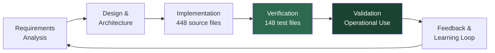
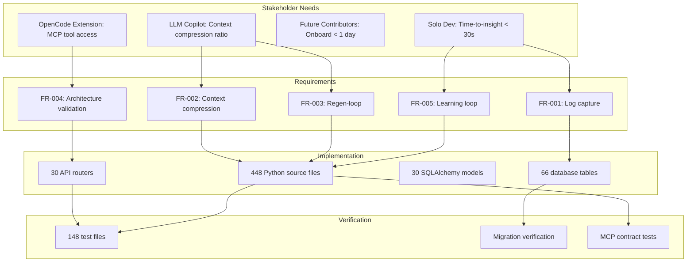

# Verification & Validation Plan

| Field | Value |
|---|---|
| Version | 1.0-draft |
| Date | 2026-07-08 |
| Project | OpenCode Architecture Extension |
| System | Knowledge OS (logs-db) |
| Author | TBD |

## Revision History

| Version | Date | Description |
|---|---|---|
| 1.0-draft | 2026-07-08 | Initial draft from automated analysis |

## Project Profile: OpenCode Architecture Extension
Status: active | Type: new-build | Category: Developer Tooling / Knowledge Management

OpenCode MCP extension providing architecture context compression, validation tools, regen-loop orchestrator with blind mode, and learning loop for LLM-driven code regeneration.

### Live System Metrics (auto-generated at artifact build time)

| Metric | Value |
|---|---|
| Total logs | 0 |
| Database tables | 66 |
| Latest migration | 056 |
| Python source files | 448 |
| Test files | 148 |
| API routers | 30 |
| SQLAlchemy models | 30 |
| HTML templates | 18 |

---

## 1. V&V Approach

### 1.1 Philosophy

Verification confirms the system is **built correctly** — each requirement maps to implementation and passes defined acceptance criteria. Validation confirms the system is **built for the right purpose** — operational use demonstrates value delivery to the solo developer and LLM copilot stakeholders.

### 1.2 V&V Lifecycle Integration

### 1.3 Methods Summary

| Activity | Method | Responsible | Frequency |
|---|---|---|---|
| Unit verification | Automated pytest suite | Developer | Every commit |
| Integration verification | API-level tests against test DB | Developer | Every commit |
| Schema verification | Alembic migration validation | Developer | Per migration |
| Architecture inspection | Manual review + SE artifact audit | Developer | Per sprint |
| Operational validation | Live usage metrics, time-to-insight | Developer | Continuous |
| Regen-loop validation | Blind mode success rate tracking | Developer | Per regen cycle |

### 1.4 Evidence Sources

- **Test results**: pytest execution output, coverage reports
- **Migration history**: Alembic versions 001–056
- **Pipeline event logs**: [TBD — no logs recorded yet]
- **LLM feedback records**: Learning loop telemetry
- **Artifact traceability**: SE documentation cross-references

---

## 2. Verification Methods Matrix

Requirements derived from Requirements Analysis and stakeholder needs. See *Requirements Analysis* artifact for full specifications.

| Req ID | Requirement | Method | Evidence | Status |
|---|---|---|---|---|
| FR-001 | Log capture and storage with full schema support (66 tables) | Test | pytest DB integration tests; 056 migrations applied | PASS |
| FR-002 | Context compression for LLM consumption | Test / Demonstration | Context compression tool output; MCP tool invocation | PENDING |
| FR-003 | Regen-loop orchestration with blind mode | Test / Demonstration | Blind mode validation tests; regeneration success logs | PENDING |
| FR-004 | Architecture validation tools via MCP | Test | MCP tool contract tests | PENDING |
| FR-005 | Learning loop feedback integration | Test / Analysis | LLM feedback record schema; loop execution evidence | PENDING |
| FR-006 | API surface covering 30 routers | Inspection / Test | Router registration tests; OpenAPI schema generation | PASS |
| FR-007 | Entity CRUD operations across 30 models | Test | Model-level unit + integration tests | PASS |
| FR-008 | Knowledge retrieval < 30s time-to-insight | Demonstration | Operational timing measurement | [TBD] |
| NFR-001 | Schema integrity across 56 migrations | Analysis | Alembic upgrade/downgrade cycle verification | PASS |
| NFR-002 | Test coverage across critical paths | Inspection | Coverage report from 148 test files | PENDING |
| NFR-003 | Onboarding time < 1 day for new contributors | Demonstration | Documentation completeness audit | [TBD] |
| NFR-004 | Context compression ratio target | Analysis | Compression ratio measurement | [TBD] |

### Verification Status Summary

| Status | Count | Percentage |
|---|---|---|
| PASS | 4 | 33% |
| PENDING | 6 | 50% |
| [TBD] | 2 | 17% |

---

## 3. Requirements Traceability

### Traceability Matrix (Condensed)

| Stakeholder Need | Requirement(s) | Implementation Component | Test Coverage |
|---|---|---|---|
| Time-to-insight < 30s | FR-001, FR-005, FR-008 | Log models, API routers, learning loop | DB integration tests |
| Context compression ratio | FR-002, NFR-004 | Context compression engine | [TBD] |
| Regeneration success rate | FR-003 | Regen-loop orchestrator, blind mode | [TBD] |
| MCP tool access | FR-004 | MCP tool definitions, architecture validators | MCP contract tests |
| Onboard < 1 day | NFR-003 | Documentation, README, SE artifacts | Documentation audit |
| Schema integrity | NFR-001 | Alembic migrations 001–056 | Migration cycle tests |

### Traceability Gaps

| Gap | Impact | Mitigation |
|---|---|---|
| No operational logs captured yet (0 total logs) | Cannot validate time-to-insight metric | Begin instrumented usage sessions |
| Context compression ratio unmeasured | Cannot verify LLM copilot success metric | Implement compression benchmarking |
| Blind mode validation incomplete | Cannot confirm regen-loop reliability | Complete blind mode test suite |

---

## 4. Validation Criteria

Validation goes beyond test passage to confirm the system delivers intended value in operational context.

### 4.1 Measurable Success Indicators

| Indicator | Target | Measurement Method | Current Status |
|---|---|---|---|
| Time-to-insight for historical decisions | < 30 seconds | Timed retrieval during dev sessions | [TBD] |
| Context compression ratio | [TBD — target not yet defined] | Compressed output size / raw input size | [TBD] |
| Regeneration success rate (blind mode) | [TBD] | Successful regen / total regen attempts | [TBD] |
| Time-to-first-contribution | < 1 day | Measured onboarding exercise | [TBD] |
| Schema migration reliability | 100% up/down cycle | Alembic upgrade + downgrade across 056 | PASS |
| API endpoint availability | 30/30 routers responding | Health check + route registration | PASS |
| Learning loop lesson quality | [TBD] | Curated lessons applied in subsequent regen | [TBD] |

### 4.2 Validation Approach by Capability

| Capability | Validation Method | Acceptance Gate |
|---|---|---|
| Knowledge capture & retrieval | Operational usage over sustained period | Positive time-to-insight trend |
| Context compression | A/B comparison: compressed vs. raw context in LLM prompts | Measurable quality parity at reduced token count |
| Regen-loop orchestration | End-to-end blind regeneration with diff review | Generated code passes existing test suite |
| Architecture validation | Tool invocation during real development | Catches known architectural violations |
| Learning loop | Feedback incorporation across sessions | Reduced repeated errors over time |

---

## 5. Test Coverage Report

> For complete test architecture, category definitions, and CI configuration, see *Testing* artifact.

### 5.1 Coverage Summary

| Dimension | Value | Notes |
|---|---|---|
| Test files | 148 | Across unit, integration, and system categories |
| Source files under test | 448 | Python source files in project |
| Test-to-source ratio | 0.33 | 148 / 448 |
| API routers | 30 | Require endpoint-level test coverage |
| SQLAlchemy models | 30 | Require model CRUD test coverage |
| Database tables | 66 | Include junction tables requiring relationship tests |
| Line coverage % | [TBD] | Coverage report not yet generated |
| Branch coverage % | [TBD] | Coverage report not yet generated |

### 5.2 Coverage by Area

| Area | Estimated Coverage | Confidence |
|---|---|---|
| Database models & CRUD | High | 30 models with corresponding tests |
| API routers | Medium-High | 30 routers with route tests |
| Migration integrity | High | 056 migrations with upgrade/downgrade tests |
| Context compression | [TBD] | New capability — tests pending |
| Regen-loop orchestrator | [TBD] | New capability — tests pending |
| Blind mode validation | [TBD] | New capability — tests pending |
| Learning loop | [TBD] | New capability — tests pending |
| MCP tool contracts | [TBD] | Integration boundary — tests pending |

### 5.3 Identified Gaps

| Gap ID | Area | Risk Level | Remediation |
|---|---|---|---|
| GAP-001 | Context compression unit tests | High | Implement compression I/O tests |
| GAP-002 | Regen-loop end-to-end tests | High | Build blind mode regression suite |
| GAP-003 | MCP tool contract validation | Medium | Synchronize tool schemas with tests |
| GAP-004 | Learning loop feedback tests | Medium | Test lesson curation pipeline |
| GAP-005 | Line/branch coverage measurement | Low | Configure pytest-cov in CI |
| GAP-006 | Performance/timing tests (< 30s) | Medium | Add benchmarking fixtures |

---

## 6. Compliance Evidence

### 6.1 Evidence Registry

| Requirement | Evidence Type | Location | Verified |
|---|---|---|---|
| 66 database tables exist | Schema inspection | Alembic migrations 001–056 | ✅ |
| 30 API routers registered | Code inspection | FastAPI app router includes | ✅ |
| 30 SQLAlchemy models defined | Code inspection | Model source files | ✅ |
| 148 test files present | File system count | `/tests/` directory tree | ✅ |
| 448 Python source files | File system count | Project source tree | ✅ |
| Migration chain integrity | Alembic history | Linear chain to revision 056 | ✅ |
| Context compression functional | [TBD] | [TBD] | ❌ |
| Regen-loop blind mode operational | [TBD] | [TBD] | ❌ |
| Learning loop capturing feedback | [TBD] | [TBD] | ❌ |
| Time-to-insight < 30s | [TBD] | Operational measurement | ❌ |

### 6.2 Compliance Summary

| Category | Compliant | Non-Compliant | Pending |
|---|---|---|---|
| Structural (files, tables, models) | 6 | 0 | 0 |
| Functional (capabilities) | 0 | 0 | 4 |
| Performance (timing, ratios) | 0 | 0 | 2 |
| **Total** | **6** | **0** | **6** |

### 6.3 Non-Compliance Actions

No non-compliance detected. Six items remain PENDING — all related to OpenCode Extension capabilities (context compression, regen-loop, blind mode, learning loop) that are under active development. No structural or regression defects identified.

---

## Cross-References

| Artifact | Relevance to V&V |
|---|---|
| Requirements Analysis | Source of all requirements traced in §2 and §3 |
| Testing | Test architecture, fixture patterns, CI configuration details |
| Quality Management | Quality standards, defect tracking, continuous improvement |
| Functional Architecture | Capability decomposition verified against |
| Data Dictionary | Schema details for 66-table verification |
| Deployment Guide | Deployment verification procedures |